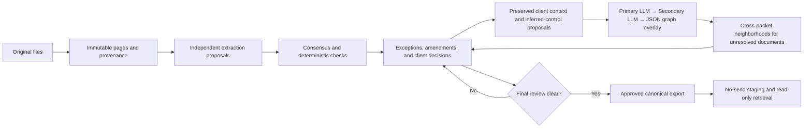

# Business Document Ingestion

An evidence-preserving control layer for turning business-document PDFs into
auditable, reviewable records. The system is deliberately precision-first: it
keeps the source visible, records corrections as amendments, and sends
uncertainty to review instead of guessing.

The stable release baseline is **1.0.0**. Current `main` also contains the
backward-compatible capabilities listed under **Unreleased** in
[CHANGELOG.md](CHANGELOG.md); those additions are not part of the immutable
1.0.0 release record until a later release is prepared and tagged. Neither the
stable baseline nor current `main` is a preconfigured live OCR/HTR service, a
target CRM connector, or a production-accuracy claim. Those require
client-authorized integration and acceptance evidence.

The project is dedicated to the public domain under [The Unlicense](LICENSE).
Courtesy credit is recorded in [NOTICE](NOTICE); contribution rules are in
[CONTRIBUTING.md](CONTRIBUTING.md).

Examples that use `python` assume the project virtual environment is active.
Run `. .venv/bin/activate`, or use `.venv/bin/python` explicitly.

## Choose your path

This checkout also documents the optional visual-intake/source-handoff work.
Its merge and verification state is recorded in [HANDOFF.md](HANDOFF.md), not
implied by the stable release number or an **Unreleased** heading.

| If you are… | Start with… | Then use… |
|---|---|---|
| A client sponsor | [Client Overview](docs/CLIENT_OVERVIEW.md) | [Plain-language process](docs/CLIENT_PROCESS_PLAIN_LANGUAGE.md) |
| Preparing or returning client files | [Client User Guide](docs/CLIENT_USER_GUIDE.md) | The returned-workbook procedure below |
| Operating the pipeline | [Technical Documentation](docs/TECHNICAL_DOCUMENTATION.md) | [Workflow Gates](references/workflow-gates.md) and [Artifact Contracts](references/artifact-contracts.md) |
| Configuring a run | [Runtime Configuration](references/runtime-configuration.md) | [Command-Line Reference](references/command-line-reference.md) and [complete CLI flag catalogue](references/cli-help-catalogue.md) |
| Setting up, deploying, or using the MCP/API | [MCP/API operations skill](skills/mcp-api-operations/SKILL.md) | [MCP Production Integration](references/mcp-production-integration.md) and [Canonical Deployment and Retrieval](references/canonical-deployment-retrieval.md) |
| Proposing new records from page images | [Record intake skill](skills/record-intake/SKILL.md) | [Visual intake contract and setup](references/visual-ingestion.md) |
| Typed analytics or governed create/amend delivery | [Record maintenance skill](skills/record-maintenance/SKILL.md) | [Client-configured business platform](references/business-data-platform.md) and [delivery record](references/business-data-platform-roadmap.md) |
| Preparing files for a selected CRM | [CRM Write Readiness](references/crm-write-readiness.md) | [Canonical Deployment and Retrieval](references/canonical-deployment-retrieval.md) and the target tenant metadata |
| Understanding client outputs, reporting, MCP/API access, and CRM-ready files | [Client Output, Reporting, and CRM Access Overview](docs/CLIENT_OUTPUT_OVERVIEW.md) | [MCP Production Integration](references/mcp-production-integration.md) and [CRM Write Readiness](references/crm-write-readiness.md) |
| Extending the code | [CONTRIBUTING.md](CONTRIBUTING.md) | [Data Model](references/data-model.md), the phase reference, and [BRANCHING.md](BRANCHING.md) |
| Preparing a stable release | [RELEASE.md](RELEASE.md) | [Branch, tag, and recovery procedure](BRANCHING.md) |
| An AI agent or successor | [SKILL.md](SKILL.md) | [AGENTS.md](AGENTS.md), [CLAUDE.md](CLAUDE.md), [CHATGPT.md](CHATGPT.md), [CURSOR.md](CURSOR.md), and [HANDOFF.md](HANDOFF.md) |
| Operating a run, not changing code | [Operations skill](skills/business-doc-operations/SKILL.md) | Its task guides: setup, pipeline, **lane checklist**, extraction, cross-checking, handwriting, business controls, evidence graph, client review lane, review reduction, client review, monitoring, delivery, troubleshooting, maintenance, subagents |
| Choosing which optional lanes a corpus needs | [Pipeline selection skill](skills/pipeline-selection/SKILL.md) | `pipeline_plan.py`, and [Artifact Contracts](references/artifact-contracts.md) for what its verdicts mean |
| Auditing the release | [Repository Audit](docs/REPOSITORY_AUDIT.md) | [RELEASE.md](RELEASE.md) and [SECURITY.md](SECURITY.md) |

### Optional visual intake (proposal-only)

The MCP servers can opt in to nine additional tools that retain original
PNG/JPEG pages, expose the extraction schema to the connected vision-capable
assistant, and retain source-cited record proposals and validation findings.
The remote OAuth server offers the same operations through a JSON API. Intake
uses a separate private owner/tenant-bound journal, never the approved snapshot.
It is disabled by default. Valid proposals are **pending review, not published**.
No intake tool applies amendments, promotes proposals into the pipeline, or
writes canonical/target-CRM records. The remote server includes an optional
same-origin upload/review portal; native chat attachment transfer is still not
assumed.
The local source-export utility can preserve a complete journal session and
prepare a hash-linked image PDF for the normal profiling/intake workflow. It
retains all originals and rejected proposals; it does not promote their values.
See the [self-contained intake guide](references/visual-ingestion.md) for flags,
scopes, limits, examples, client requirements and acceptance, and the
[business-platform guide](references/business-data-platform.md) for governed
analytics and separately authorized target delivery.

| Surface | Default | With separately authorized intake |
|---|---|---|
| Local stdio MCP | 12 approved-fact tools through the shell launcher | 23 tools through `retrieval_mcp.py --ingestion-dir`; 31 with the eight local platform operations; trusted local owner |
| Remote OAuth MCP | 14 tools including CSV/XLSX and package-download jobs | Up to 25 tools, or up to 34 with the nine platform operations, filtered by granted CRM, intake and platform scopes |
| TLS/bearer REST | Read-only GET queries | Unchanged; no intake routes |
| Remote OAuth JSON API | No intake routes | Eleven `POST /api/ingestion/{operation}` routes sharing the journal and MCP permissions, and `POST /api/platform/{operation}` for the platform operations |
| Internal retrieval sidecar | Not enabled by default | Private localhost/same-task `FastAPI` API for a co-located app through `retrieval_sidecar.py` |
| Local source handoff | Not part of the served query surface | `visual_ingestion_export.py export` / `verify`; new private archive, not a CRM export |

Tool counts describe discovery, not permission to operate. Use
`get_crm_capabilities` for approved reporting and `get_ingestion_schema` for
proposal intake. A valid intake receipt cannot enter sales totals, account
cards, CRM import files, or canonical retrieval without the ordinary independent
controls and authorization. The separate client-configured platform implements
allowlisted saved analytics and governed create/amend delivery; arbitrary joins,
SQL, model approval, deletion, and canonical mutation remain forbidden.

The documentation has deliberate ownership boundaries:

- This README explains what the repository is and where to begin.
- The technical guide is the end-to-end operator manual.
- `references/runtime-configuration.md` owns every environment setting.
- `references/command-line-reference.md` owns command discovery and invocation
  controls; the generated `references/cli-help-catalogue.md` captures every
  shipped flag and subcommand help, while each executable's `--help` remains the
  exact option contract.
- `references/artifact-contracts.md` owns file shapes and no-clobber rules.
- `references/workflow-gates.md` owns phase entry and exit conditions.
- `HANDOFF.md` records only current state and next actions, not durable design.
- Target-specific receivers belong on the destination system side. This
  repository stops at verified, no-send canonical/common CRM packages plus the
  shared Claude/ChatGPT MCP and read-only API surfaces that expose them.

### Internal retrieval sidecar

For a co-located internal application, this repository also ships
`scripts/retrieval_sidecar.py`, a thin `FastAPI` wrapper over `crm_service.py`.
It is intended for localhost or same-task container use rather than public
internet exposure, and it reads the same immutable approved-fact SQLite snapshot
used by the MCP and HTTPS transports.

It supports `GET /health`, `GET /capabilities`, `POST /account_card`,
`POST /query_records`, `POST /search_records`, `POST /analyze_sales`, and
`POST /run_report`.

Runtime configuration comes from `HOST`, `PORT`, `LOG_LEVEL`,
`RETRIEVAL_DB_URL`, and `RETRIEVAL_ARTIFACT_ROOT`. Run it locally with:

```bash
python scripts/retrieval_sidecar.py --database /ABSOLUTE/PATH/business_retrieval.sqlite
```

Or build the dedicated container image with:

```bash
docker build -f Dockerfile.retrieval-sidecar -t business-doc-ingestion-retrieval .
```

The container entrypoint is `python scripts/retrieval_sidecar.py`, so ECS/task
`HOST`, `PORT`, and `LOG_LEVEL` override the image defaults. The CRM task uses
`PORT=8081` with `RETRIEVAL_BASE_URL=http://127.0.0.1:8081`.

For a full live run, the operating skill requires a non-secret
`RUN/logs/run_authorization.md` before the first provider call and a strict
phase state machine thereafter. The note authorizes transmission only, never
proposal acceptance or production actions. The final queue is built only after
all selected upstream lanes have completed or retained an explicit blocker;
workspace audit and required lane coverage close the run.

## The trust model

These eight orientation points are a deliberately shorter, non-exhaustive
summary. [`AGENTS.md`](AGENTS.md) holds the normative eleven-rule list; when
this overview and the normative list differ in detail, the latter governs.

1. Every source page and original extracted value is retained.
2. Corrections are append-only amendments; evidence is never edited in place.
3. Every unresolved or malformed item becomes an explicit exception.
4. Applicable arithmetic, attribution, and completeness checks are separate
   gates; one cannot stand in for another.
5. LLM output, provider confidence, grouping, and client workbook imports are
   proposals until authorized changes are applied and the affected controls are
   rerun. Independence belongs to the model vendor, not the transport, so a
   router serving another vendor's model counts as that vendor -- and two
   vendors reached through one router are two readings only where each declares
   it read the source itself. Self-reported confidence is provenance, never a
   decision term. A second reader is qualified by the values it returns, never
   by a matching row count: `engine_agreement.py` reports value recall and
   field-exact agreement, and an engine can return exactly the right number of
   rows having misread most of their content.
6. Only approved, provenance-linked facts with no open review enter canonical
   retrieval or downstream staging.
7. A control that processed nothing has not passed. Empty or unusable input
   produces an explicit exception and a refusal, never a clean result.
8. A value outside its plausible range is a misread figure, not a policy
   question. Nothing infers a unit, a date order, or a country from magnitude.



The inferred branch is optional, bounded, and proposal-only: it preserves every
client response and provider artifact, but cannot create GL/payment facts,
authorization, or independent consensus. The diagram is a control flow, not a
promise that every external service is configured. Same-model prompt roles are not independent consensus. Google
Document AI is corroborating OCR/table evidence only. Financial, identity,
handwriting, arithmetic, provider/schema, reassembly, missing-field, and other
unresolved-evidence findings remain protected review work.

The disabled-by-default Google Cloud Vision handwriting lane OCRs every retained
page with the handwriting-capable document-text feature, binds words only to
separately detected handwriting regions, and retains one HTR proposal vote plus
all raw/page evidence and exceptions. It cannot validate itself; HTR acceptance
counts genuinely independent provider groups, not model or prompt-role names.

Every completed iterative or cross-packet pass is finalized through a separate
retry boundary. The run directory is frozen, all provider-retryable exceptions
are retried into a new directory, and the retry overlay is reconciled before
the final manifests are emitted. Non-retryable data and coverage exceptions
remain explicit.

The disabled-by-default `client_review_exception_resolution.py` lane is reusable
across runs: it converts supplied reassembly, validation, and attribution
exceptions into bounded, source-backed primary/buddy proposals. When retained
client responses exist, their hash-bound reasoning-only context accompanies the
packet but cannot serve as evidence or consensus input. Its overlays never
replace records or clear gates; deterministic controls are rerun after
review. Both reviewers inspect the same findings, compact source records, and
reasoning-only context. Missing source IDs, packet caps, oversized work,
provider failures, and invalid or out-of-packet proposals remain explicit.
Retryable failures retain the original named findings, kinds, and exception IDs
so a no-clobber recovery does not replace control context with a generic error.
Final card review may optionally request arithmetic/reassembly next steps, but
those protected findings remain review-required.

The shared retry runtime also honors `LLM_FAIL_FAST_ON_PROVIDER_QUOTA=true`.
When a provider returns a recognized account/model quota response, the
process-local provider circuit closes before further calls; each unsent item is
retained as an explicit provider exception for a separately authorized retry.

## What is implemented

- Byte-verified source retention, conservative one-page PDF splitting,
  provenance, scan profiling, image variants, and review-only reassembly and
  exact-duplicate candidates.
- Run-level provider-selected LLM proposal extraction with strict schemas,
  raw-response retention, bounded retries, shared throttling, caching,
  manifest-order output, quota-aware fail-fast protection, and explicit
  failures.
- Source-native table profiling and row proposals, bounded corpus refinement,
  optional Document AI corroboration, and deterministic exact-registry table
  reconciliation.
- Optional page-complete Google Cloud Vision handwriting OCR with retained page
  renders, region-bound HTR proposals, explicit failures, and provider-group
  independence enforcement in handwriting reconciliation.
- Multi-engine consensus, arithmetic proof, amendment-only adjudication,
  deterministic validation, local address normalization, opt-in Address
  Validation, independent HTR-result reconciliation, entity resolution (with a
  person's decisions about named pairs carried in by `--party-decisions`),
  attribution, completeness, sampling, and gate-aware analytics.
- Evidence-graph schema inventory plus a retained-candidate schema surface that
  exposes source-cited address, contact, representative, and other repeated
  candidate fields without promoting them past consensus or client review, plus
  source-hash-bound recovery scopes for contained address/contact retries.
- A broad controlled extraction vocabulary plus a source-labelled extension
  channel, so an unfamiliar visible field is retained for schema review rather
  than excluded by a finite provider schema.
- Source-template observations built from a completed consensus run, which give
  semantic mapping, allocation-policy discovery, and template-drift analysis the
  input artifact they consume, and slot-equivalence proposals that ask whether
  two schema slots hold one fact.
- A lane-coverage report that names every pipeline lane a run produced no output
  for, so a run cannot look complete while whole controls were never invoked.
- A loadable CRM grain beside the field grain: every money, count and date
  column gets a typed companion, and every row that a loader must handle deliberately says
  so on the row. A duplicate line, a line repeating one in another document, an
  amount with no item, and the document's own total rows -- `P.O. Total:`, or
  a bare `Total :` -- are each labelled rather than dropped, because summing
  them silently is how a document's commission gets counted twice. A page read
  in two passes, which fills different columns each time, is caught by its job
  and amount; and a field that reads one way on the same line's other
  statements is named, because the corpus's own repetition is the only witness
  for fields no arithmetic can test. A row also names its company fields that
  hold a heading, a placeholder or an address, and its person fields that hold
  a code, a report's footer, a role, a brand or the client. A document that
  prints only decimal commas has its amounts typed (`2 199,03` is 2199.03), and
  a rate carries `__percent` only where a `%` or the line's own arithmetic
  proves its unit. Each party column carries the master's key beside the
  resolved name, and `augment_export.py --parties` writes the accounts and
  contacts a CRM loads beside the grains, joined on that key rather than built
  from the raw columns. `--product-rules` reads each line's product by its
  manufacturer's own rule -- never from `description`, which holds projects
  and specifiers for most of them -- and `--extractor-raw` checks each code
  against the row its line's amounts are printed on. An inferred party carries
  its account's key (`<column>__inferred_party_key`), a line's customer or
  dealer is filled from a purchase order, job or project number the same
  maker's other lines print beside one party -- scored on held-out lines
  before it fills anything -- and a month the page names without a day types
  as `<column>__month`.
- A cell the page never rendered -- Excel's `####`, a number collapsed into
  scientific notation, a value cut off mid-word -- is carried with `-99999` in
  its typed money column, so a load fails loudly instead of accepting a
  plausible zero. Text cut off the same way is flagged, with the one completion
  the corpus offers proposed beside it and never written over the reading.
- A per-line arithmetic label: `commissionable_amount x stated_commission_rate`
  against the printed commission, allowing for a rate the document printed
  rounded. A line that fails is carried and labelled, never corrected -- most
  failures are the document contradicting itself.
- Recovery of a printed column the schema had no field for, read back out of
  retained independent-extractor layout and joined to lines by a printed key
  they already carry, with no provider call. A recovered value travels as a
  single reading, never as vendor agreement. The manufacturer is recovered the
  same way from the printed letterhead, against a vocabulary the corpus itself
  supplies, so no brand is invented and none is kept beside the code.
- Verification against the page itself rather than against another model.
  `accuracy_sample.py` draws the pages to read, stratified by layout and random
  within a stratum, from every document -- not only the auto-accepted ones,
  which on one run was none. `page_review.py` hands a reviewer one page's image
  and the rows the export claims for it, takes back the money **the page**
  prints, and names lost money (printed, held nowhere) and invented money
  (counted, never printed) mechanically. With `--proposals` it turns what the
  reviewers found into corrections an operator can authorize, each graded by
  the independent evidence beside it. Run over all 716 pages of one corpus,
  it found a commission read from a sub-column no arithmetic could test, and
  total rows counted as lines. `page_review_amend.py` applies the corrections
  an independent source backs as append-only amendments, refusing any that
  would break a line's own base x rate = commission and holding a figure moved
  between lines until both halves are proved: 630 pages reconciled with their
  image before the corrections, and 650 after. A correction the reviewer alone
  supports waits for another vendor: `page_review.py --second-read` regrades it
  where that vendor's reading of the page holds the figure, and the export
  labels -- never drops -- a row the review says the page does not print.
  `column_refile.py` moves a
  reading an engine filed under the nearest field -- a Specifier column read as
  the dealer -- to the field the page's heading names, under a named
  authorization, keeping the original filing on the reading.
  `records_in_step.py` keeps a record's two copies of each reading -- the flat
  fields the export reads and the views the controls read -- in step, where
  three lanes had written one and not the other.
- Filling what the export leaves empty from what the run already knows -- a
  line's brand from its own letterhead, a job's customer from the other
  statements that print it, a branch or state a party's name prints, an ISO
  country code, an E.164 phone, and who a dealer is from cited public sources --
  always in labelled columns beside the reading, never over it. Where a dealer
  or brand trades can come from Google Places (`party_locations.py`, optional
  and off by default): business names only, one request per party within a
  cap, and a match accepted only when it accounts for every word of the name.
- A client review pack that shows several worked examples spread across each
  question's group, never leads with a page scan profiling flagged `near_blank`,
  and names the documents and columns each question is about. A question is only
  as good as the page shown with it: one that led with a blank page was answered
  "can be ignored" for 285 documents, of which four were blank.
- A pipeline planner that reads a run's own retained artifacts and proposes
  which optional lanes this corpus needs, which it does not, and which client
  questions the plan cannot avoid. It authorizes nothing, and an unmeasured lane
  is reported undecided rather than defaulted either way.
- A run sentinel that verifies every enabled lane's credential before the run
  spends anything (including the local ADC token-minting path for Google), and
  reads retained provider failures while the run happens, telling a credential
  fault from a configuration one from a transient one.
- Proposal-only card review that reviews cards concurrently without letting the
  worker count reach the artifact, cross-record evidence search, full-dataset
  review, protected-item policy, deterministic grouping, and a reproducible small
  client-review package.
- Safe consolidation as a self-contained orchestration: with `--enable` it re-runs
  the cross-record and full-dataset lanes into its own output directory rather
  than reusing earlier artifacts, so a second cross-record pass is part of its
  cost. Without `--enable` it consolidates only from inputs already sitting at its
  own filenames. `--disable-client-package` stops it short of issuing the client
  workbook, and its `--run-dir` must be absolute because the lanes it invokes run
  from the repository root.
- Client decisions travel a hash-bound chain: an issued workbook, a returned copy
  validated against it, an explicit append-only change catalog that must repeat
  the client's wording byte-exact, a content-hashed impact plan, and a
  default-defer operator authorization bound to that plan. Six change types
  compile and authorize, but only `template_registry_rule` has an implemented
  consumer today; the rest are proposals a future apply loop would execute.
- Proposal-only inferred-control artifacts, preserved client-response context,
  general JSON/CSV/TSV/TXT/Markdown client-input comment context for corpus
  reasoning, bounded reference discovery, a Primary-LLM/independent-Secondary-LLM
  iterative relationship-proposal lane with automatic material-yield convergence,
  graph-guided cross-packet discovery for
  in-packet-unresolved documents plus independent verification of resolved
  proposals with convergence-controlled follow-up for newly exposed
  neighborhoods, deterministic JSON evidence-graph queries, and bounded
  graph-inventory context plus Primary-LLM/Secondary-LLM checking for
  source-template schema-discovery proposals.
- Versioned canonical PostgreSQL planning, checksummed load planning, atomically
  verified no-send CSV/API staging with authoritative per-row JSON/checksums and
  exact receiver topology, and an integrity-manifested approved-fact SQLite snapshot. The
  local stdio MCP, OAuth-protected remote Streamable HTTP MCP, and explicitly
  enabled TLS/bearer HTTPS share indexed cross-table search,
  exact canonical-record lookup, governed filtering/projection/sorting,
  account/address/contact cards, multidimensional sales analysis, checksummed
  table export, and seven deterministic standard reports. The remote MCP also
  creates bounded, owner-bound CSV/XLSX report or table downloads with snapshot,
  row, and file checksums plus short expiry.
- A secret-free client YAML can add typed many-to-one analytical datasets,
  dimensions, metrics, filters, fiscal/date grouping, having, totals, pagination,
  saved reports, and checksummed analytical CSV/XLSX jobs. The same deployment
  can expose schema-guided create/amend proposals; separate operator-only,
  signed and expiring authorization/apply/reconcile API routes and CLI deliver
  through a no-send file or generic HTTPS JSON adapter without mutating the
  snapshot. Those operator API routes are not MCP tools.
- Run manifests, resumable state, adapter contracts, privacy inventories,
  usage/spend telemetry, reviewer exports, CI, release checks, and acceptance
  fixtures.
- Client-authorized golden-set evaluation with abstention-aware metrics,
  per-template/field/risk breakdowns, and fail-closed review exceptions.
- Exact source-layout fingerprint/drift analysis plus an append-only approved
  template registry path.
- Returned-decision compilation with exact impact/rerun previews, content
  hashing, immutable workbook-to-consolidation lineage, choice-specific catalog
  validation, and separate default-defer operator authorization.

## What remains client-specific

- Selection and authorization of genuinely independent production extraction
  and HTR providers.
- Client authorization of a representative golden set and acceptance thresholds
  before any accuracy, auto-acceptance, or reduced-review claim.
- Client privacy, retention, residency, mapping, amendment, and allocation
  decisions.
- Production deployment of calibrated handwriting or party-role detectors.
- Client configuration and sandbox/production acceptance of its target receiver,
  identity provider, signing/target secrets, golden totals, rollback, and
  reconciliation behavior.
- Public hosting, identity-provider/workspace registration, and acceptance for
  the implemented tenant-bound remote MCP, or any hosted vector/reranking
  service.

These are explicit integration boundaries, not hidden capabilities.

## Install and verify

Python 3.12 or newer is required. Acceptance and document workflows also use
Poppler (`pdfinfo`, `pdftotext`, and `pdftoppm`) and Tectonic 0.17.0.

```bash
python3 -m venv .venv
.venv/bin/python -m pip install -r requirements-dev.txt
PYTHON_BIN=.venv/bin/python bash scripts/quality_gate.sh
```

The release gate requires 100% statement and branch coverage for `scripts/`,
clean Ruff checks, valid local documentation links, synchronized tracked
documents, and complete runtime/command documentation. Run it in a normal
terminal or CI worker; it has no interactive-output capture deadline. CI applies
a 45-minute safety timeout to each quality and acceptance job. Pull requests run
the strict quality gate first, then the separate acceptance controls; direct
pushes run only for `main`, preventing duplicate branch-and-PR execution while
preserving post-merge verification. Workflow action revisions are full commit
pins, checkout credentials are disabled, and the workflow contract itself is
covered by regression tests. LaTeX rendering remains manually dispatched.

## Configure a run

```bash
cp .env.example .env
```

Keep `.env` private. Precedence is: explicit CLI option, process environment or
secret manager, root `.env`, then the safe code default. Credentials never
belong in a manifest, run directory, response package, or commit. Use
`operations.py manifest --config-from-env` to retain effective non-secret
settings and redacted credential-variable names.

Every environment setting, its default, constraints, operational effects, and
change guidance is in
[Runtime Configuration](references/runtime-configuration.md). Every executable
and subcommand is indexed in
[Command-Line Reference](references/command-line-reference.md); run the shown
`--help` command for exact positional arguments and invocation-only overrides.

Before any Google-backed run, use:

```bash
python scripts/reauthorize_google.py
```

The helper refreshes user and Application Default Credentials, verifies both
token paths, and can write short-lived Document AI and Cloud Vision access-token
variables to a user-selected `0600` file outside the repository. Never put a
token or service-account JSON value in `.env`.

## Set up and test the MCP/API

Use the [MCP/API operations skill](skills/mcp-api-operations/SKILL.md) as the
governing setup, deployment, connection, acceptance, query, monitoring, and
shutdown workflow. It routes to the detailed contracts and keeps three distinct
surfaces from being confused:

| Surface | Intended use | Entry point |
|---|---|---|
| Local stdio MCP | Same-machine Claude Code/Desktop or compatible client | `bash scripts/run_retrieval_mcp.sh --help` |
| Remote Streamable HTTP MCP | Authorized Claude or ChatGPT workspace/mobile/web connection | `python scripts/retrieval_remote_mcp.py --help` |
| Unified client-configured MCP/API | Retrieval, analytics, exports, optional intake, and proposal maintenance | `python scripts/business_platform_server.py --help` |
| TLS/bearer REST API | Controlled internal application or BI pilot | `python scripts/retrieval_https.py --help` |

All three read one immutable SQLite snapshot built only from approved,
provenance-linked, review-clear Phase 6 facts. The REST API is not an MCP
connector, and protocol compatibility does not prove that a particular client
plan, workspace, or mobile surface supports registration.

Before using a client snapshot, prove repository code readiness with the
fictional no-clobber acceptance:

```bash
bash scripts/run_mcp_production_acceptance.sh --help
PYTHON_BIN=.venv/bin/python bash scripts/run_mcp_production_acceptance.sh \
  /tmp/mcp-production-acceptance
```

A pass covers canonical loading, all-table no-send staging, immutable retrieval,
all twelve local tools, all fourteen remote tools, all seven standard reports,
OAuth/owner boundaries, content-free auditing, and checksummed CSV/XLSX
downloads. It does not replace acceptance of production TLS/DNS, the real
identity provider, the selected Claude/ChatGPT workspace, operational recovery,
or the exact approved non-empty client snapshot. Those checks are defined in
[MCP Production Integration](references/mcp-production-integration.md).

For the unified surface, start with the fictional
[`client-platform.example.yaml`](config/client-platform.example.yaml), then read
the [client-configured platform contract](references/business-data-platform.md).
Generate a no-secret deployment receipt with `business_platform_deploy.py` and
choose the provided non-root container, Compose, single-writer Kubernetes, or
systemd template. Client OAuth, TLS, target-system, golden-total, and actual
Claude/ChatGPT connector acceptance remain required before production use.

## Operate the pipeline

Work from [`tasks/lane-checklist.md`](skills/business-doc-operations/tasks/lane-checklist.md):
every lane in dependency order, the options that change what an artifact means,
and the measurement and process traps that have cost real runs. A lane starts
only after the previous one has written its terminal artifact and you have read
it.

Use a new run directory for every attempt. Initialize it, then put every
pipeline-writing command through the contained workspace wrapper. It keeps
generated artifacts, raw responses, cache, throttle state, retries, and command
logs below one root; source inputs and credentials remain external read-only
boundaries.

```bash
python scripts/run_workspace.py init /ABSOLUTE/RUN_ROOT
python scripts/run_workspace.py run /ABSOLUTE/RUN_ROOT -- \
  python /ABSOLUTE/REPOSITORY/scripts/scan_profile.py /ABSOLUTE/SOURCE.pdf \
  --out profile.json
python scripts/run_workspace.py audit /ABSOLUTE/RUN_ROOT
```

The wrapper accepts the operating guides' `RUN/...` and technical guide's
`RUN_DIR/...` placeholders and makes them run-root-relative. Do not send a
pipeline output, cache, or throttle path to a sibling directory or repository
root.

The canonical phase sequence is:

1. Discover scope, privacy, retention, source systems, business questions, and
   acceptance criteria.
2. Profile scans; retain and split originals; create sibling image variants.
3. Propose and review page grouping, duplicates, document family, and party
   role.
4. Run genuinely independent extraction lanes and retain raw evidence.
5. Reconcile consensus and, where applicable, source-native table evidence.
   Build the source-template observations with `template_observations.py`; the
   mapping, allocation-discovery, and drift lanes all read that artifact and
   cannot run without it. If client comments arrived outside the review
   workbook, parse them with `client_input_comments.py` and supply the resulting
   reasoning-only context to the corpus; pass `--records` or the relationship
   lanes receive no records to reason over. Comments never become document
   evidence or approval.
6. Optionally run page-complete Google handwriting OCR over separately detected
   regions. Prove arithmetic; validate fields; normalize addresses; reconcile
   genuinely independent HTR provider groups;
   resolve entities; attribute money; and report completeness.
7. Build the exhaustive final queue, proposal-only review aids, and sampling
   plan. Analytics stay blocked unless their required gates are clear. Whenever a
   control blocks, `client_review_lane.py build` turns its findings into one
   client pack -- grouped questions, the source page behind each, a workbook to
   answer in and an instruction PDF to answer from. Each control has its own
   threshold, so the lane can run after every stage without producing a pack
   nobody needed. `read-answers` validates the returned workbook against the
   issued copy and extracts the client's answers as decision proposals.
8. Apply only authorized append-only mappings or amendments, rerun affected
   lanes and downstream gates, then rebuild review.
9. After the final gate clears, create the canonical export, deployment/load
   plan, no-send staging package, and approved-fact retrieval store.
10. Before calling the run complete, run `run_lane_coverage.py` over the run
    directory. It names every lane that produced nothing, so a lane you meant to
    run and did not is stated rather than assumed.

Run `run_sentinel.py preflight` before step 4 and leave `run_sentinel.py watch`
running beside the run. For Document AI and Vision, preflight accepts an unset
token variable when local Application Default Credentials can mint and discard a
fresh token; it still refuses unavailable ADC or missing long-lived keys. A
credential or configuration fault then stops the run when it happens rather than
being discovered in the artifacts afterwards.

The exact commands, input/output contracts, failure recovery, and checklists are
in [Technical Documentation](docs/TECHNICAL_DOCUMENTATION.md).

## When the client returns the workbook

Preserve the issued and returned workbooks as separate immutable files in a new
run/output directory. Then import the returned copy against the issued copy:

```bash
python scripts/client_review_package.py import-decisions \
  returned_client_review.xlsx \
  --issued-workbook issued_client_review.xlsx \
  --out client_decisions.json
```

A successful import proves package integrity, including the hidden immutable
safe-consolidation lineage, and produces proposals only. It
does not change production facts. Confirm that the import is complete and has
no invalid decisions. Compile an explicit impact and rerun preview with
`client_decision_compile.py`, complete its default-defer operator authorization,
then apply only authorized append-only mappings or amendments. Rerun only the affected
classification, mapping, extraction, or source-quality lane, followed by
consensus, arithmetic, validation, applicable entity/attribution/completeness
checks, the final review queue, safe consolidation, and the client package.

Batch decisions cannot clear protected findings. Do not say client decisions
have been applied until evidence reconciliation, completeness, and the final
review gate all pass.

For preparation only, `scripts/ai_simulated_client_review.py` can create a
separate AI draft-comment package from the final queue. Supply retained source
evidence with one or more `--evidence` arguments; context-only client responses
cannot serve as evidence. Every comment explicitly
states **“AI client reviewed (simulated; not client authorization)”**, includes
source-visible evidence and raw-response provenance, and remains outside the
issued/returned client workbook. It cannot approve records, remove findings,
clear controls, or permit canonical/CRM staging. See
[`automation-controls.md`](references/automation-controls.md) for the exact
command and [`runtime-configuration.md`](references/runtime-configuration.md)
for the configurable provider/model limits.
Source records are de-duplicated within each packet and bound back to individual
review items; accepted quotes retain the exact source reference and JSON
pointer. An atomic hash-bound checkpoint supports `--resume` after interruption.
Use `--retry-exceptions` only to create a separate no-clobber recovery overlay
for explicitly retained provider, size, cap, missing-source, or post-run
evidence-audit exceptions.

## Repository map

| Path | Purpose |
|---|---|
| `scripts/` | Executable control logic; each CLI supports `--help` |
| `skills/` | Pipeline operations, MCP/API deployment/use, and optional source-image record intake skills |
| `agents/` | Agent entry-point configuration |
| `scripts/client_review/` | The whole review layer: protection, queue, grouping, questions, evidence, rendering, and every reasoning lane |
| `tests/` | Unit, branch, CLI, workflow, and release regression coverage |
| `assets/` | Canonical DDL, schemas, mappings, and templates |
| `references/` | Authoritative phase, parameter, method, and artifact contracts |
| `docs/` | Client-facing and technical guides plus generated PDF/LaTeX triples |
| `fixtures/` | Synthetic, public, and opt-in acceptance/calibration inputs |
| `examples/` | Clearly labelled fictional field-shape samples only |
| `mcp/` | Portable local read-only retrieval configuration |

For current verification evidence and known limitations, see
[Repository Audit](docs/REPOSITORY_AUDIT.md). For security or privacy concerns,
follow [SECURITY.md](SECURITY.md).
