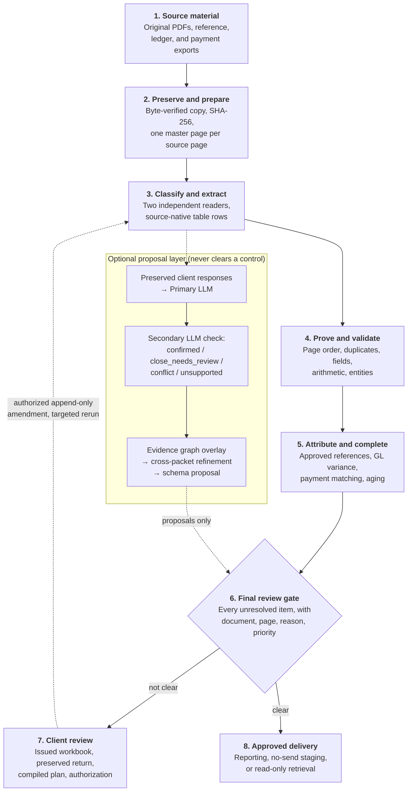
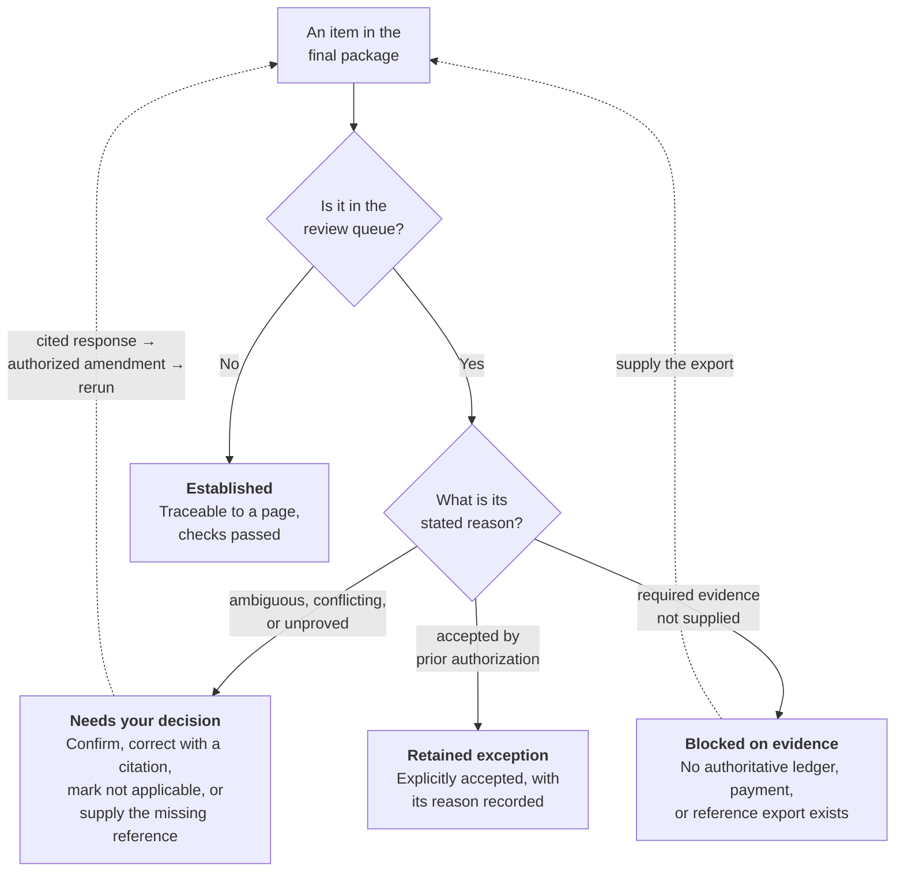

# Business Document Ingestion: Client Overview

## Purpose

Business Document Ingestion turns a collection of business records into a
traceable, reviewable data package. It is designed for invoices, purchase
orders, statements, commission reports, receipts, remittances, shipping
documents, credit memos, and related records.

The system does more than read text. It preserves the original evidence,
records how a value was found, checks that values are internally consistent,
and makes uncertainty visible. The goal is to give your team organized data
that can be traced back to the original page before it is used for reporting,
reconciliation, or a later system load.

Courtesy credit is given to Christopher Melhauser and `theonlymuffinbot`.
`theonlymuffinbot` describes collaborative AI tooling and is not a claim of AI
legal authorship or ownership.

## What the system is designed to deliver

At the end of a successful run, your team receives a package that can include:

- preserved source documents and page-level fingerprints;
- extracted fields, line items, tables, and document classifications;
- source citations and raw provider outputs for every AI-assisted proposal;
- arithmetic, validation, attribution, completeness, and final-review results;
- an Excel workbook, CSV exports, HTML reviewer views, and canonical JSON;
- a clear exception list for anything that is missing, ambiguous, or not yet
  authorized; and
- an approved-record staging or retrieval plan when the required gates are
  clear.

The system does not silently turn uncertainty into a passing result. A missing
reference, conflicting reading, or unavailable accounting control remains an
explicit exception until it is resolved or formally retained as an exception.

## The central rule: evidence first

Every original page and extracted value is retained. A later correction is an
append-only amendment linked to its evidence; it does not overwrite history.
This approach allows a reviewer to answer four practical questions for any
important value:

1. Where did this value come from?
2. Which page or source row supports it?
3. Which checks did it pass or fail?
4. What changed, who authorized it, and when?

AI, mappings, groupings, inferred relationships, and client workbook imports
are proposals until an authorized operator applies an append-only change and
the affected controls are rerun.

## How the workflow works

The process is staged so a later phase cannot erase an earlier failure.

The eight stages below match the eight boxes in the diagram above. Each one
states what the stage does, how it does it, and what it produces, so this
section can be read on its own.

### Step 1: The source material you supply

**What it does.** Establishes the evidence base. Everything the system can
later prove is bounded by what arrives at this step.

**How it does it.** You supply the original source PDFs, unedited, in the order
you received them, together with any available supporting exports: approved
ACK, job, project, PO or order references; general-ledger data for the matching
periods; and payment or remittance exports. Exports are read with the column
headings your system already prints, so renaming columns is unnecessary and
actively harmful — it edits the evidence before it is read.

**What it produces.** The delivery itself becomes retained evidence. Where an
export does not exist, that absence is recorded as a known limitation rather
than being worked around silently.

### Step 2: Preserve and prepare

**What it does.** Freezes exactly what was received so that any later finding
can be traced to a specific delivered page.

**How it does it.** The system keeps the original source, creates a SHA-256
fingerprint, verifies the retained copy byte-for-byte, and records a manifest of
what was received. PDFs are separated into ordered one-page masters. For
difficult scans, the workflow keeps the grayscale master and creates enhanced or
black-and-white variants beside it; a profiling pass records contrast, skew, and
compression concerns and sets the handwriting branch.

**What it produces.** A verified source copy, one immutable master per page, an
intake manifest binding every page to its source file and position, comparison
image variants, and a scan profile. Image improvements are aids for reading;
they never replace the original source page.

### Step 3: Classify and extract

**What it does.** Determines what each document is and reads the values printed
on it.

**How it does it.** The system identifies document families and extracts printed
fields, headers, totals, dates, parties, identifiers, and source-native table
rows — invoice and acknowledgement numbers, purchase orders, jobs, projects,
payment references, commission rates, customer names, and amounts. Where two
genuinely independent extraction providers are configured, each reads the same
page separately and the readings are compared; the system refuses two lanes that
resolve to a single model vendor, because that is not independent evidence.
Tabular documents are additionally read by a source-native table pass that
follows the layout the document actually uses.

**What it produces.** Extraction proposals linked to their exact page, a
consensus result recording agreement and disagreement, and retained raw provider
responses. Agreement is useful evidence; disagreement, a single reading, or a
provider failure remains review work. A provider's confidence score alone is not
proof.

### Step 4: Prove and validate

**What it does.** Tests whether the documents hold together internally, before
anything is compared against outside systems.

**How it does it.** The workflow checks page order and grouping, surfaces
possible duplicates, validates required fields and formats, and proves
arithmetic against source-visible values — line extensions, taxes, discounts,
freight, credits, subtotals, and document totals. It resolves entities and
addresses through a reversible merge log, and checks readings for plausibility
without inferring a unit, date order, or country from magnitude.

**What it produces.** An arithmetic proof result, a validation result, a
reassembly proposal, and a duplicate-candidate list — each recording what was
checked and what could not be proved. If a number does not add up, a page
sequence cannot be proved, or a handwritten change conflicts with printed
information, the issue stays visible. The system does not repair it by guessing,
and a control that had nothing to check is reported as failed rather than clear.

### Step 5: Attribute and test completeness

**What it does.** Connects amounts to your business references, then measures
what the documents alone cannot establish.

**How it does it.** When your business process requires an amount to be
associated with an ACK, job, project, purchase order, order, claim, or other
reference, the system applies the reference hierarchy you approve. Where
general-ledger and payment or remittance exports are available, it compares
document totals by accounting period, matches invoices to payments including
partial payments, and computes aging.

**What it produces.** An attribution result with a full evidence chain per
amount; an unattributable register listing every amount that could not be
linked, with its reason and value; and a completeness report with period
variances, payment matches, and aging status. Unmatched rows are reported back
with their original heading and content rather than dropped. Unmatched amounts
are never assigned to a convenient but unsupported reference, and a variance is
reported rather than plugged.

Authoritative ledger and payment records are categorically different from
document evidence, and are required to close the corresponding controls. Where
they are absent, see the inferred-proposal section below.

### Step 6: The final review gate

**What it does.** Collects everything unresolved into one queue and decides
whether the run may advance.

**How it does it.** Every review-bearing artifact from every preceding stage —
including recovery artifacts — is gathered into a single exhaustive queue. Items
may be grouped by root cause so one decision can answer many similar cases, but
grouping never removes an underlying item. Financially material issues are
prioritized.

**What it produces.** The canonical `final_client_review.json` queue plus CSV,
Excel, and HTML views of it, and a final reconciliation manifest stating which
controls passed, which were not applicable, and which remain blocked. This
manifest — not the appearance of the spreadsheet — is the authoritative answer
to whether the run can advance.

### Step 7: Client review and authorization

**What it does.** Captures your decisions without letting any of them apply
themselves.

**How it does it.** The client-review package identifies the records that need a
decision. When a workbook returns, the issued and returned copies are preserved
separately and unchanged. The system validates the workbook structure against
the issued copy, records every response and note into a preserved-response
snapshot, and verifies that no response was omitted or altered. An operator then
compiles a change plan stating exactly which mapping, amendment, or policy
change is affected, which documents and fields are involved, and which
downstream controls must rerun. Each proposed change is authorized individually,
bound to the unchanged plan; anything not chosen stays deferred rather than
being treated as a silent no.

**What it produces.** A preserved-response record, a compiled change plan, an
operator authorization bound to that plan, and — only then — applied append-only
amendments. This keeps client feedback visible without allowing a returned
workbook to bypass the control process.

### Step 8: Rerun and approved delivery

**What it does.** Re-proves everything downstream of an authorized change, then
produces the handoff.

**How it does it.** Approved amendments are append-only: the original value
remains in the audit trail beside the amendment. The affected extraction or
mapping lane is rerun, followed by arithmetic, validation, attribution,
completeness, and final review, in that order. Reruns are written to a new
output location so an earlier manifest or package is never silently replaced.

**What it produces.** A regenerated package showing both the original client
response and the resulting control status, and — only when the gate is clear or
the remaining items are explicitly retained as approved exceptions — a canonical
export, load plan, vendor-neutral no-send staging package, or read-only
retrieval store.

### What each stage produces, at a glance

| Stage | Principal outputs | Can it clear a control? |
|---|---|---|
| 1. Source material | Retained delivery; recorded gaps | No — it defines what is provable |
| 2. Preserve and prepare | Verified copy, page masters, intake manifest, scan profile | No |
| 3. Classify and extract | Extraction proposals, consensus result, raw responses | No — proposals only |
| 4. Prove and validate | Arithmetic proof, validation result, duplicate and grouping proposals | Yes, for arithmetic and validation |
| 5. Attribute and complete | Attribution result, unattributable register, completeness report | Yes, where authoritative exports exist |
| 6. Final review gate | Canonical review queue, reviewer views, reconciliation manifest | It reports the gate |
| 7. Client review | Preserved responses, compiled plan, authorization, amendments | No — authorization is not clearance |
| 8. Rerun and delivery | Regenerated package, canonical export, staging or retrieval | Yes, on rerun of the affected controls |

## How the optional AI-assisted relationship process works

The system can use AI to find relationships that deterministic extraction may
have missed. This is useful when no more client data will arrive and the source
documents contain printed ACK, job, project, PO, invoice, order, payment,
remittance, party, or template clues.

The AI process is bounded and evidence-based:

1. The system constructs a packet from retained source records and preserved
   client responses. Client comments are reasoning context, not source proof.
2. The Primary LLM proposes only source-visible relationships and must cite the
   supporting document and evidence quote.
3. An independently configured Secondary LLM checks the same packet and labels
   each proposal `confirmed`, `close_needs_review`, `conflict`, or
   `unsupported`.
4. Confirmed proposals are added as immutable graph overlays; they do not
   change source evidence or canonical data.
5. Later passes examine unresolved evidence neighborhoods. The process stops
   when a pass produces no material new, source-backed, Secondary-LLM-confirmed
   relationship or reaches its configured limit.
6. A graph-guided cross-packet pass examines related documents that could not
   be matched within a single packet. Its configured neighborhood has explicit
   document and byte limits, with separate exceptions for deferred or
   identifier-less records.

This process can improve reference discovery, relationship modeling, and
understanding of repeated layouts. It cannot create an authoritative ledger
balance, payment-system transaction, or client authorization from document
evidence alone.

## Schema discovery: how the system learns the structure

After retained extraction and relationship evidence are available, the system
can build a proposal-only schema inventory. It identifies observed field names,
counts, examples, document/template families, repeated line structures, and
possible relationships.

The schema-discovery process can propose that a printed label likely represents
a PO, ACK, customer, commission amount, or other business concept. It does not
silently establish that mapping. A high-confidence proposal still needs clear
source-template evidence, independent Secondary LLM review where configured,
and the normal authorization path before it becomes a reusable rule.

## What happens when client ledger, payment, or reference exports are missing

The system can build clearly labeled inferred-control proposals from retained
document evidence. These may include source-linked attribution candidates,
document-total rollups, explicit printed payment markers, and a detailed
exception register.

These artifacts prioritize work and explain missing evidence. They do not
substitute for a general ledger, payment system, or approved reference export;
the final manifest keeps the corresponding control blocked unless authoritative
evidence or an explicitly accepted exception is available.

## The output: what you receive and how to read it

The optional development extension can retain original PNG/JPEG page images
and let a connected vision-capable assistant propose schema-mapped fields.
Receipts, unknown labels, uncertainties, corrections and rejections remain
visible. A valid submission means **pending review, not published**; it cannot
update the approved database or a CRM. The operator can export a private source
archive and, for complete usable sources, a hash-linked image PDF for normal
profiling/intake. Independent verification, business controls and authorization
still apply. There is no bundled mobile capture app or attachment relay, and
actual upload/vision support needs client acceptance. Governed record writes
and expanded custom analytics remain development work. The
[output guide](CLIENT_OUTPUT_OVERVIEW.md) explains these capabilities in context;
[Visual Intake](../references/visual-ingestion.md) defines the technical limits.

This section is the summary of the deliverable. It describes what is in the
package, what each part is for, how to read a result correctly, and what the
package deliberately declines to claim.

For a self-contained explanation of the approved-data package, reports,
MCP/API access, controlled downloads, and CRM-ready inputs, see
[`CLIENT_OUTPUT_OVERVIEW.md`](CLIENT_OUTPUT_OVERVIEW.md). That guide is the
plain-language bridge from this delivery package to safe day-to-day use.

### What is in the package

**1. The canonical review record.** `final_client_review.json` is the complete
machine-readable queue and the authoritative list of what needs a decision.
Each item identifies the document and page, the field, region or relationship
in question, the reason it is open, its priority, and the evidence supporting
the proposed reading.

**2. The reviewer views.** `final_client_review.csv`, `.xlsx`, and `.html`
present that same queue in forms that are easier to filter, sort, and discuss.
They are convenience copies, not separate records; where they disagree with the
JSON, the JSON governs. The Excel workbook carries `Header Definitions`,
`Schema Definitions`, and `Runbook` sheets so it can be understood without
another file.

**3. The final reconciliation manifest.** This reports which controls passed,
which were not applicable, and which remain blocked. It is the authoritative
answer to whether the run can advance.

**4. The evidence and audit trail.** Retained source documents and page-level
fingerprints; extracted fields, line items, tables, and classifications; source
citations and raw provider outputs for every AI-assisted proposal; the
unattributable register and exception registers; preserved client responses; and
every authorized amendment with its operator and timestamp.

**5. The onward package, when the gate permits it.** A canonical export, load
plan, vendor-neutral no-send CRM/API staging package, or citation-backed
read-only retrieval store.

### How to read a result correctly

- **A passing control means the control ran and proved something.** A control
  that processed nothing is reported as failed, not clear, so a green result is
  never an artifact of an empty input.
- **A blocked control names what is missing.** If no ledger or payment export
  was supplied, completeness stays blocked and says so. An inferred proposal
  cannot substitute for it, and the status
  `blocked_inferred_controls_not_authoritative` is not renamed or removed.
- **An exception is a result, not a process failure.** The system is designed to
  end with a precise list of what remains unresolved rather than a confident
  answer it cannot support.
- **A confidence score is provenance, never a decision term.** Neither a high
  score nor agreement between two readers performs the authorization step.
- **Every value is traceable.** For any value you can ask where it came from,
  which page supports it, which checks it passed or failed, and what changed,
  who authorized it, and when.

### For each open item, choose one outcome

- Confirm the displayed value or grouping.
- Provide the corrected value, with the supporting page or system reference.
- Mark the item as not applicable, with a reason.
- Provide the missing reference, payment, or ledger record.

A response should identify the supporting source or system record wherever
possible. Corrections are recorded as amendments; the original page and the
original reading remain available for audit.

### What the package deliberately does not claim

The delivery will not tell you that a missing general ledger reconciled, that an
unmatched amount belongs to a plausible-looking reference, that a handwritten
financial change was accepted because two readers agreed, or that an AI proposal
is approved. Each of those remains an open item with its reason attached.

A clear review queue also does not prove that a required source, ledger,
payment, or authorization step was supplied in the first place, and it is
exhaustive only for the source artifacts listed inside that package. The final
package states both what has been established **and** what remains unavailable,
unresolved, or awaiting approval. Those two statements together are the
deliverable.

## What your team needs to provide

The best input is the original source PDF set plus any available supporting
exports. Helpful inputs include:

- approved ACK, job, project, PO, order, or other business-reference exports;
- general-ledger data for the same periods, when reconciliation is required;
- payment or remittance exports, when invoice payment status or aging matters;
- a list of the business questions the resulting data must answer; and
- any original or higher-quality scans for pages that are difficult to read.

If one of these sources does not exist, tell the operator. The workflow can
continue with explicit inference and exception controls, but it will not claim
that a missing authoritative control has passed.

## What requires your review

The final package focuses your attention on records that need a business
decision. Common examples include:

- a document type, date, party, or page sequence that cannot be established;
- a conflicting provider or source reading;
- a handwritten correction or unclear printed value;
- a total that does not reconcile within the document;
- an amount with no approved business reference;
- a payment or ledger condition that cannot be verified; and
- a proposed template or schema mapping that needs approval.

The package prioritizes financially material issues while retaining every source
item in the audit record.

## What happens after you respond

Your issued workbook is preserved unchanged, and the returned workbook is
stored separately. Before an operator interprets a response, the system copies
every choice and note into a preserved-response record and checks that no
response has been omitted or altered. The returned workbook itself remains
evidence; it is never used to overwrite the original source document.

Next, the operator compiles an impact plan. It states exactly which proposed
mapping, amendment, or policy change would be affected, which documents and
fields are involved, and which downstream controls must run again. An
authorized operator chooses each proposed change separately. Deferred or
unsupported choices remain open rather than being treated as a silent no.

The affected stages are rerun in a new output directory. The system then
rechecks downstream evidence, arithmetic, validation, attribution,
completeness, and final review. The regenerated package shows both the original
client response and the resulting control status, giving your team a clear
before-and-after audit trail.

## Privacy, access, and deployment boundaries

Source material remains under the run's evidence controls. Optional external
services are disabled unless explicitly enabled for an approved run. Their
results are proposals or corroboration, not automatic truth. Credentials stay
outside the repository and are not written into a client delivery package.

The release can produce a vendor-neutral staging package and an
approved-facts-only local retrieval service. Production CRM delivery, public
hosting, or claimed accuracy rates require separate authorization and evidence.

## When delivery is complete

A delivery is complete only when the named final-review package is clear and
the applicable controls have passed or are explicitly retained as approved
exceptions. Depending on the scope, this includes arithmetic, attribution,
completeness, sampling, and final-review gates. The delivery identifies the
exact source set, run manifest, approved amendments, exceptions, and any
staging or retrieval plan so it can be independently reviewed later.

A clear review queue does not prove that a required source, ledger, payment, or
authorization step was omitted. The final package states both what has been
established and what remains unavailable, unresolved, or awaiting approval.
