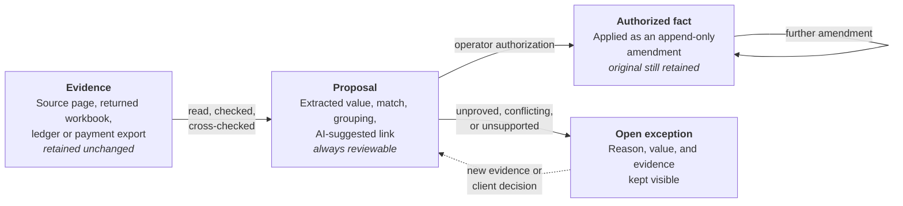
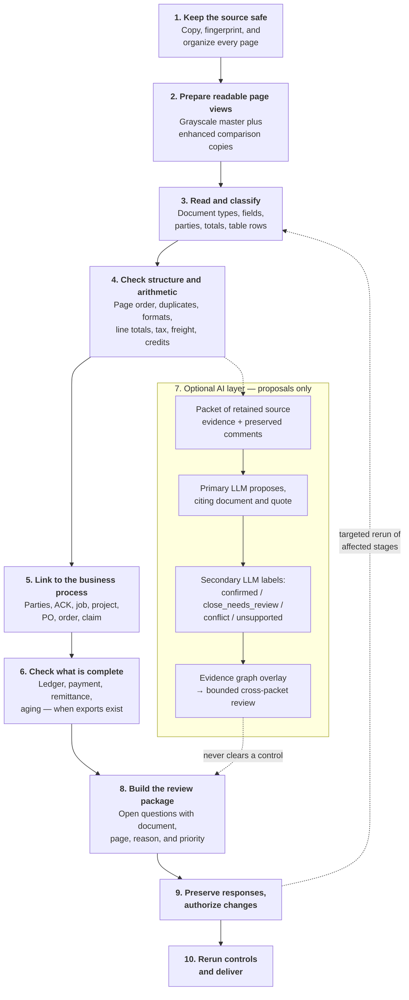

# How the document process works

## What this guide explains

This plain-language guide explains what happens to a document delivery, what
the system can establish from evidence, and where a client decision is still
needed. It is a companion to the Client Overview and Client User Guide, and it
is written to be read on its own: every stage below states what the stage does,
how it does it, and what it produces.

The central promise is simple: the system preserves what was supplied, explains
how it reached each proposed conclusion, and leaves uncertainty visible. It
does not silently replace a source value, invent an accounting record, or treat
an AI response as approval.

## Three words that carry the whole process

Almost every question about this system is answered by knowing which of three
states a piece of information is in. The states never blur together, and
nothing moves between them by itself.

| State | What it means | What can change it |
|---|---|---|
| **Evidence** | Something that was actually supplied — a source page, a returned workbook, a ledger export. | Nothing. Evidence is retained unchanged, forever. |
| **Proposal** | Something the system worked out — an extracted value, a match, an AI-suggested link, a grouping. | Review. A proposal is never a fact just because it looks confident. |
| **Authorized fact** | A proposal an operator explicitly approved, applied as an append-only amendment. | Only a further authorized amendment, which is also appended. |

A confidence score, an agreement between two readers, and an AI explanation are
all just descriptions of a proposal. None of them performs the authorization
step.

## The workflow at a glance

Read the solid spine from top to bottom: stages 1 to 6 and 8 to 10 are
deterministic, they run in that order, and they are the only path that can clear
a control. Stage 7, drawn to the side in dashes, is the optional AI layer. It
can add proposals and questions, but it never clears a control and never writes
a value on its own. The dashed arrow returning from stage 9 to stage 3 is the
rerun loop: once an authorized change is applied, every stage it could affect
runs again, so a correction can never leave an earlier check reported against
superseded data.

## The process from beginning to end

Each stage below follows the same shape: **what it does**, **how it does it**,
and **what it produces**.

### 1. Keep the source safe

**What it does.** Establishes an unchangeable record of exactly what you sent,
so that every later finding can be traced back to a specific delivered page.

**How it does it.** The delivered file is copied into a new run folder and
fingerprinted with a SHA-256 hash, and the copy is verified byte-for-byte
against the original. The system then creates ordered one-page masters — one
per source page — and records everything in an intake manifest that binds each
page to its source file and position.

**What it produces.** The retained source copy, one immutable master image per
page, and an intake manifest listing every file, hash, page count, and page
identifier.

Do not edit, rename, split, rotate, or replace a source file after delivery.
If a better copy becomes available, it is added as a new source so the original
and the replacement can both be accounted for.

### 2. Prepare readable page views

**What it does.** Makes difficult scans easier to read without ever altering
the evidence.

**How it does it.** The workflow keeps the grayscale page master and may create
enhanced and black-and-white views beside it. These are siblings, not
replacements — the master is never overwritten. A separate profiling pass
records image-quality concerns such as low contrast, skew, faintness, and
compression risk, and decides whether the handwriting branch is needed.

**What it produces.** A set of comparison page images, plus a scan profile that
routes poor pages to review rather than treating them as clean extractions. A
page with uncertain numeric content or unreadable handwriting is flagged here,
not silently accepted.

### 3. Read and classify the documents

**What it does.** Identifies what each document is and reads the values printed
on it.

**How it does it.** The system identifies document families — invoices,
purchase orders, receipts, statements, remittances, credit memos and related
records — and extracts visible headers, parties, dates, identifiers, totals,
and table rows. Where the document is tabular, a source-native table pass reads
the rows in the layout the document actually uses. Where two genuinely
independent readers are configured, both read the same page separately and the
readings are compared.

**What it produces.** A set of extraction proposals, each linked to the exact
page that supports it, plus a comparison result. Agreement between independent
readers is useful evidence. A disagreement, a single reading, or a provider
failure becomes review work rather than a silent choice between the two.

Confidence scores can help prioritize work, but they are never proof by
themselves, and two readings from the same underlying model are not treated as
independent.

### 4. Check structure and arithmetic

**What it does.** Tests whether the documents hold together internally, before
anything is compared against the outside world.

**How it does it.** The workflow tests whether pages appear to belong together,
surfaces possible duplicates, validates expected field formats, and checks
financial arithmetic against source-visible values. It can test line
extensions, subtotals, taxes, discounts, freight, credits, and document totals
whenever the necessary values are actually present on the page.

**What it produces.** An arithmetic proof result and a validation result, each
recording what was checked, what passed, and what could not be proved. If the
math cannot be proved, a sequence cannot be supported, or handwritten and
printed values conflict, the issue stays visible as an exception. The system
does not make an unverified correction merely to make a report look complete,
and a control that had nothing to check is recorded as failed rather than
clear.

### 5. Link the records to the business process

**What it does.** Connects documents and amounts to the business references
your organization actually uses.

**How it does it.** When you supply approved reference data, the system
proposes links between a document or amount and an ACK, job, project, purchase
order, order, claim, or other approved reference, following the reference
hierarchy you approve. It also proposes parties, roles, and repeated template
relationships from source-visible clues, and resolves entity names through a
reversible merge log so a merge can always be undone.

**What it produces.** An attribution result linking each in-scope amount to its
reference with an evidence chain, and an unattributable register holding every
amount that could not be linked, with its reason and value. An unsupported
match is never converted into a convenient answer.

### 6. Check what is complete — and state what is not

**What it does.** Distinguishes what the documents can prove from what only
your accounting systems can prove.

**How it does it.** Source documents can establish what is printed on them.
They cannot, by themselves, establish an authoritative general-ledger balance
or a payment-system transaction. When you supply ledger, payment, and
remittance exports, they are used for period comparison, invoice/payment
matching, partial payments, aging, and reconciliation. Exports are read with
the column headings your system already prints, so you do not need to rename
anything.

**What it produces.** A completeness report with period variances, payment
matches, and aging status — and, for any row that could not be matched, an
entry returned to you with its original heading and content rather than being
dropped.

If those authoritative exports do not exist, the system can produce clearly
labelled document-based proposals: likely references, printed payment markers,
document-total rollups, and an exception register. These help focus review, but
they do not clear an accounting or payment completeness control, and the final
manifest keeps that control blocked.

### 7. Use AI only as a bounded proposal process

**What it does.** Finds relationships that deterministic extraction missed —
and nothing more.

**How it does it.** Optional LLM work starts with a packet built from retained
source evidence and preserved client responses; client comments are reasoning
context, never source proof. The Primary LLM may propose a relationship or
field meaning only when it can cite a specific document and evidence quote. An
independently configured Secondary LLM — from a different model vendor, not
merely a different transport — reviews the same packet and classifies the
proposal as `confirmed`, `close_needs_review`, `conflict`, or `unsupported`.

Source-backed agreements are stored as an immutable overlay in an evidence
graph. Later passes focus only on unresolved evidence neighborhoods and stop
when they stop finding material new relationships or reach the run's configured
cost and iteration limits — at most three passes by default.

Some relationships are visible only across documents. A bounded cross-packet
review looks at related records sharing a printed identifier — order, ACK, job,
project, invoice, remittance, or payment reference — and can also re-check an
earlier proposed link against other retained documents. A match remains a
proposal; a conflict remains visible.

**What it produces.** A proposal overlay, every raw request and response,
provider status, and an explicit exception for any record that could not be
processed, named by its exact source document ID. Nothing here changes the
original page, canonical data, or approval status, and the deterministic
control that raised a finding must run again before its status can change.

### 8. Build a focused client-review package

**What it does.** Puts the open questions in front of you in the order that
matters.

**How it does it.** Every review-bearing artifact from every stage is collected
into a single queue. Each item states the document and page, the field or
relationship in question, why it is unresolved, its priority, and the
supporting evidence. Related items may be grouped so that one decision can
answer many similar cases.

**What it produces.** The canonical JSON review record, plus CSV, Excel, and
HTML views of the same queue for filtering and discussion. Grouped workbooks
may show representative examples to reduce repeated review effort, but the
complete underlying queue is always retained internally — grouping never
deletes an item.

### 9. Preserve every response and authorize changes carefully

**What it does.** Makes sure your answers survive intact, and that no answer
applies itself.

**How it does it.** The issued workbook and the returned workbook are kept
separately and unchanged. Before the operator interprets anything, the system
creates a preserved-response record capturing every choice and note, and checks
that no response was omitted or altered. The operator then compiles a change
plan identifying each proposed amendment, the affected fields and documents,
and the controls that must run again. An authorized operator chooses each
proposed change individually; anything not chosen stays deferred rather than
being treated as a silent no.

**What it produces.** A preserved-response snapshot, a compiled change plan,
and — only after explicit authorization bound to that unchanged plan — an
authorized change plan. A returned workbook, an LLM proposal, or a high
confidence score never applies a production fact by itself.

### 10. Rerun the affected controls and deliver a clear result

**What it does.** Applies what was authorized and re-proves everything
downstream of it.

**How it does it.** Approved amendments are append-only: the original value
remains in the audit trail beside the amendment. The system reruns the affected
extraction or mapping work, then the downstream arithmetic, validation,
attribution, completeness, and final-review controls, in that order. Reruns
happen in a new output location so an earlier manifest or package is never
silently replaced.

**What it produces.** A regenerated review package showing both the original
client response and the resulting control status, and a final reconciliation
manifest reporting what passed, what was not applicable, and what remains
blocked or retained as an accepted exception. Only a clear final gate, or
explicitly retained approved exceptions, permits an approved reporting,
staging, or retrieval package.

## What you get at the end, and how to read it

The final delivery is built so that a reader never has to guess the status of a
record. It separates the three states described at the top of this guide, and
it says plainly what it could not establish.

For the companion guide to using approved outputs after delivery — including
MCP/API access, record search, reports, controlled downloads, and CRM-ready
input packages — see [`CLIENT_OUTPUT_OVERVIEW.md`](CLIENT_OUTPUT_OVERVIEW.md).

There is also an optional way to submit new page photographs. A compatible
application sends the original PNG/JPEG image, the connected assistant reads it
against the field dictionary, and the service retains a proposed record and its
review receipt. A chat attachment is not proof of that upload. Successful
submission means **pending review**, not a new approved customer or invoice.
Corrections are additional proposals; originals and failures stay retained.

The processing team can export the source history and, when complete, prepare
an image PDF for the ordinary document checks. A missing page or failed
preparation stops that handoff. No proposal automatically enters reports or CRM
files. Native capture, shared review screens, approved-record editing and
broader custom analytics are not bundled; the output guide describes what is
available and what remains to be built.

### The four things in the package

1. **The canonical review record.** `final_client_review.json` is the complete
   machine-readable queue and the authoritative list of what needs a decision.
   Every item carries its document, page, field or region, reason, priority,
   and supporting evidence.

2. **The reviewer views.** `final_client_review.csv`, `.xlsx`, and `.html`
   contain the same queue in forms that are easier to filter, sort, and discuss.
   They are convenience copies of the JSON, not separate records. Where a
   grouped client package is issued instead, it is limited to the review
   workbook, a plain-language guide, and decision pages showing one
   representative source page per choice.

3. **The final reconciliation manifest.** This is the answer to the only
   question that determines whether the run can advance: which controls passed,
   which were not applicable, and which remain blocked. A clean-looking
   spreadsheet is not a clearance decision; this manifest is.

4. **The evidence and audit trail.** Retained source pages and fingerprints,
   raw provider responses for every AI-assisted proposal, the unattributable
   register, exception registers, preserved client responses, and the record of
   every authorized amendment with its operator and timestamp.

### How to read a result correctly

- **A passing control means the control ran and proved something.** A control
  that had nothing to process is reported as failed, not clear — so a green
  result is never an artifact of an empty input.
- **A blocked control names what is missing.** If there was no ledger or
  payment export, completeness stays blocked and says so. It is not quietly
  downgraded, and an inferred proposal cannot substitute for it.
- **An exception is a result, not a failure of the process.** The system is
  designed to end with a precise list of what remains unresolved rather than a
  confident answer that cannot be supported.
- **Every number can be traced.** For any value in the package you can ask
  where it came from, which page supports it, which checks it passed or failed,
  and what changed, who authorized it, and when.

### What the package deliberately does not claim

The delivery will not tell you that a missing general ledger reconciled, that
an unmatched amount belongs to a plausible-looking reference, that a
handwritten financial change was accepted because two readers agreed, or that
an AI proposal is approved. Each of those remains an open item with its reason
attached.

A clear review queue also does not prove that a required source, ledger,
payment, or authorization step was supplied in the first place. The final
package states both what has been established **and** what remains unavailable,
unresolved, or awaiting approval. Those two statements together are the
deliverable.

## What a golden dataset means

A golden dataset is a small, representative group of real or safely redacted
documents with trusted expected results. It should cover different layouts,
clear and poor scans, printed and handwritten values, financial calculations,
identity and reference relationships, repeated information, and difficult or
ambiguous examples.

The team uses it to measure whether extraction, review routing, arithmetic
proof, and completeness controls behave as expected. It is a measurement tool,
not a shortcut around client review or evidence requirements.

## The important promise

The system can make a large document collection understandable and can reduce
unproductive review work. It never converts uncertainty into a silent pass. A
source-backed proposal, a client response, and an authorized production fact
remain distinct states throughout the process.
