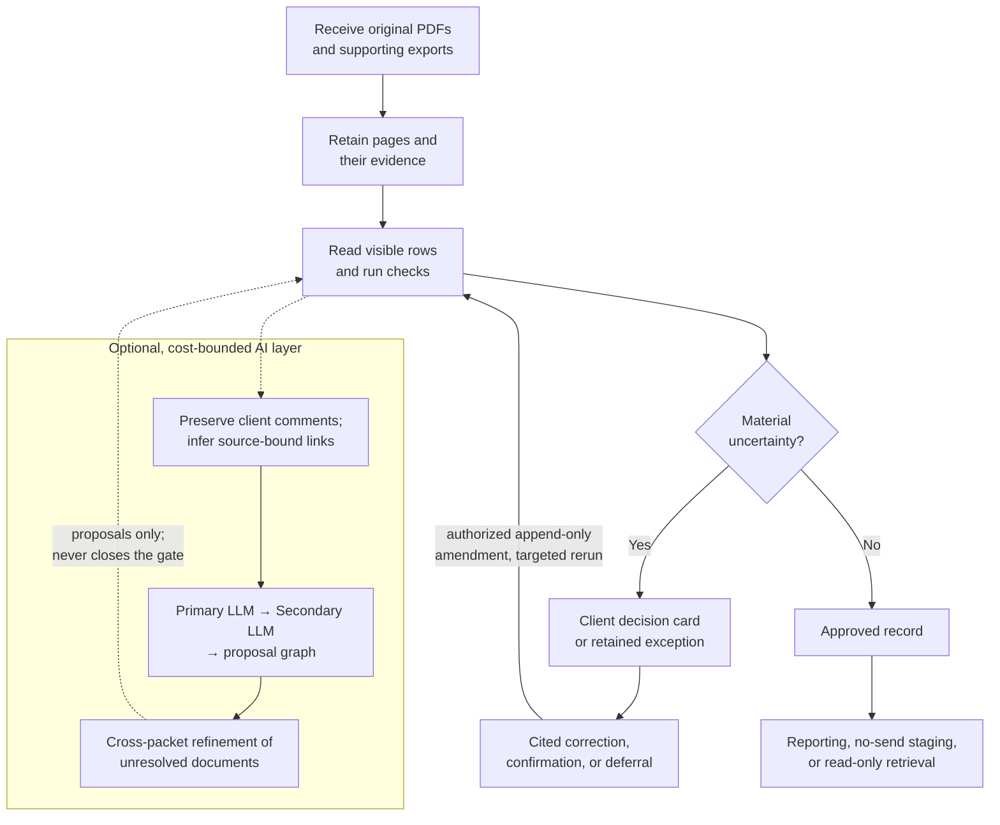
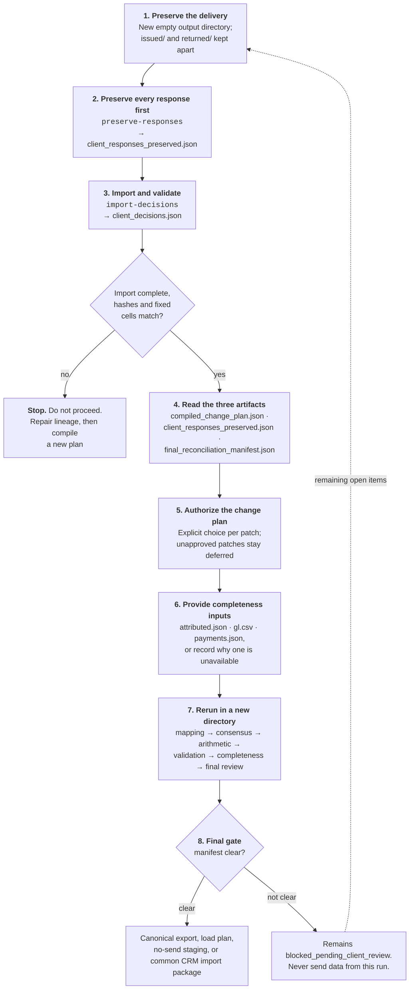

# Before you send documents

## Authorship and AI collaboration context

Courtesy credit is given to Christopher Melhauser and `theonlymuffinbot`.
Here, `theonlymuffinbot` describes collaborative AI tooling. This identifies
the tooling context and does not assign legal authorship or ownership to an AI
system.

## Operator readiness

### Optional image-submission workflow

If your engagement enables the visual-intake pilot, you can submit original PNG
or JPEG page images through a compatible application for the connected
vision-capable assistant to read. This is separate from the ordinary PDF
delivery below and from the approved reporting database. Agree the source set,
provider data flow, ownership and retention location first. The operator must
also satisfy the existing MCP deployment gate; intake is not enabled by default.

Keep originals unchanged. The current limit is 1 to 20 declared pages per
session, 10,000,000 original bytes and 25,000,000 pixels per image. Direct PDF,
HEIC, WebP, animation and URL uploads are not supported. The application must
transfer real bytes; do not assume a photograph attached to chat has reached
the service. Smaller deployment request limits may apply. No capture app or
attachment relay is supplied by this repository.

Retain the session ID and every upload/proposal receipt outside the chat. Ask
the assistant to discover the schema, read all retained pages, cite their
locations, preserve unfamiliar labels and identify uncertain values. Even a
valid result is **pending review, not published**. An unreadable or rejected
page stays visible. Corrections create another proposal, not an edit to an
approved account/contact/invoice. Retry an uncertain request with exactly the
same key and content; changed content needs a new key. Replacing an already
retained source page requires a new session, preserving the old one.

For processing, an authorized local operator exports the session to a new
private source archive, verifies it against the separately retained receipt,
and inspects the complete derived image PDF before normal profiling/intake.
The archive retains every original attempt, proposal version and rejection,
with a page map and review exceptions. A blocked archive or partial PDF must
not advance. Normal independent extraction, business controls, authorization
and final review remain required before any new approved snapshot or CRM file.

See [Visual Intake](../references/visual-ingestion.md) for exact tools, flags,
permissions and recovery, and [Client Output Overview](CLIENT_OUTPUT_OVERVIEW.md)
for everyday queries, reports and the distinction between source and CRM exports.

### Standard pipeline provider preparation

For a Google-backed run, the operator should refresh credentials immediately
before a live run:

```bash
python scripts/reauthorize_google.py
```

The helper asks for the GCP project, refreshes both gcloud login and Vertex AI
Application Default Credentials, verifies that tokens can be issued, and can
prepare a temporary Document AI token file. Credentials and tokens stay outside
the repository and must never be included with client documents or run output.
If `GOOGLE_APPLICATION_CREDENTIALS` is set, confirm that its external file is
current; otherwise Vertex AI uses the refreshed local ADC.

1. Keep the original files unchanged. Do not rename, split, rotate, or combine
   pages after delivery unless you also retain the original copy.
2. Send PDFs in the order you received them. A single PDF with many pages is
   acceptable; the process creates one output file per source page.
3. Include your reference exports when available: purchase orders, jobs,
   projects, account codes, general ledger, payments, and remittance records.
4. Tell us the date range, document types you expect, currency or currencies,
   and the business questions you want answered.
5. Flag any material privacy, retention, residency, or access restrictions.

## Recommended delivery structure

Place the delivery materials in four clearly labelled folders or files:

- `source_pdfs/` — original PDFs; no edited replacements;
- `reference_exports/` — purchase order, job, project, or other approved
  business references;
- `accounting_exports/` — general-ledger, payment, and remittance data when
  available; and
- `delivery_notes.txt` — date range, known issues, and requested outcomes.

If a source PDF has multiple pages, do not split it yourself. The process keeps
the delivered PDF as a byte-identical, SHA-256-verified source copy and creates
an ordered, one-page output for each page.

# What happens after delivery

1. Every page is profiled and retained.
2. Pages are placed in sorted, one-page output files.
3. The process proposes multi-page groups only when page markers, document type,
   and business identifiers agree. It can also surface an unordered same-type / unique-ID candidate, clearly marked for page-order review rather than assembled automatically.
4. Extracted values are checked for agreement, mathematical consistency, and
   business-format rules.
5. Uncertain, handwritten, duplicate, missing, or conflicting evidence is
   collected for review.

## Process flow and the optional AI layer

**Original PDFs and references** → **immutable intake** → **independent
proposals** → **consensus, proof, and validation** → **final client-review gate**
→ **reporting or agreed load handoff**.

When the gate is open, the client supplies a confirmation, correction, or cited
evidence. The operator records an amendment or decision and regenerates the gate.
Optional AI output always enters this same path; it never closes the gate.



The AI step is optional and cost-bounded. Address parsing is local by default.
If an approved run enables external address validation, each unique address may
be sent within a stated cap of no more than 5,000 calls per run; the result is a
deliverability and geographic proposal, never a replacement for the original.
The configured LLM preserves a raw response and page hash, returns
document-type and likely handwriting-region proposals and review flags, and is
never the only reader or final decision-maker. The image-preparation stage keeps
grayscale, contrast-enhanced, and complementary black-and-white copies for
comparison; none replaces the original page. A separately enabled LLM
adjudication lane may assess only explicit, printed, nonfinancial candidates
after deterministic validation and independent agreement. Its confidence floor
defaults to `0.99` and may be adjusted from `0.99` to `1.0`; it still creates a
clearly audit-marked amendment proposal for client review, never a
client-approved record.

An optional card-level client-review assistant can summarize all supplied
extractor, schema, arithmetic, validation, entity, and handwriting evidence. It
may identify low-risk review items that depend on another item, but it never
approves facts or deletes findings. The retained output contains every original
item; only a clearly labelled client-facing view may collapse an explicitly
covered dependency. Protected financial, handwriting, arithmetic, provider,
identity, and reassembly findings remain visible.

Each item may also include an evidence-backed `llm_proposed_update` with the
original value, proposed value, field, evidence, and rationale. A separate
cross-record phase may find supporting evidence elsewhere in the supplied run.
Both are proposals only. A thresholded carry-forward is disabled by default,
and `scripts/simulate_client_approval.py` is reserved for simulation-only
stress tests; it cannot approve production facts or populate retrieval.

The final review stage can use a separately configured LLM. All other
client-review controls are inherited from the current run, and the selected
provider and model are retained in the internal audit metadata.

### AI-assisted draft comments are not client decisions

An operator may generate an optional companion review workbook using an AI
simulated-client reviewer. Every comment is visibly labelled **“AI client
reviewed (simulated; not client authorization)”** and includes its model,
source-visible evidence quote, and raw-response audit reference. It is a way to
prepare a reasoned draft and to identify the items that deserve your attention;
it does not speak for you, change your workbook, approve a record, or close a
review item. Financial, identity, arithmetic, provider, reassembly, and other
protected findings always remain human review work.

The reviewer keeps item-specific source citations, an interruption-safe
checkpoint, and explicit exceptions. An interrupted run may resume only when
its queue, evidence, and configuration hashes still match. Any later retry is a
separate retained overlay; prior comments and failures are never overwritten.

If you wish to use the draft, compare each proposed recommendation with the
original source and make your actual decision in the returned review workbook.
We preserve both the issued and returned workbooks, retain the AI companion
package separately, compile your decisions, apply only separately authorized
append-only changes, and rerun the affected controls. Missing ledger or payment
evidence is not cured by an AI draft.

For a multi-year statement corpus, the optional table-comprehension lane retains
one evidence-linked source-row proposal per page. Later pages may provide layout
context--headers, sections, totals, and template fingerprints only--for bounded
rereads of uncertain earlier pages. Any changed reading becomes a linked
amendment proposal. When an initial audit identifies a concern, Google Document
AI may provide a page-matched buddy check; financial, identity, handwriting,
mapping, and reassembly issues still remain in the final review package.

## Mapping names and locations

If a source uses an unfamiliar label, the system proposes a standard business meaning and places it in the review package. It does not silently add a new field or reuse that proposal for another layout. Once you approve a mapping, it is versioned for that exact layout; a later header, dealer name, brand name, relationship, or city change is reviewed again. Names and relationships are kept with their effective history.

An address printed on a page can be validated separately. If the document only gives a dealer or brand name, the optional Google Places check can provide possible locations. It is a short candidate list for your review, not an automatic match or replacement address. Approved, provenance-linked records can then be delivered as a vendor-neutral CRM staging package with no-send CSV/API instructions and a citation-backed retrieval database. An optional verified no-send package also reshapes approved facts into common account, contact, address, product, transaction, shipment, and payment CSVs, with a target-mapping worksheet and write/reconciliation plan. Those files do not authorize an upload: the client CRM team must validate the actual tenant fields and keys, approve the mapping, prove idempotency and rollback in a sandbox, and separately authorize the exact production package. The database can be queried through local read-only MCP, an explicitly enabled TLS-only bearer REST API, or the separately deployed OAuth-protected remote MCP for approved Claude or ChatGPT mobile/web/desktop access. The remote MCP can create bounded, expiring, checksummed CSV/XLSX downloads from approved tables or standard reports. Selecting a target CRM and accepting public hosting, identity-provider, workspace, privacy, retention, and user-access controls remain separate client decisions; none of these read-only interfaces writes to a CRM.

## Commission and sales-credit review

Some commission reports include multiple allocations for one order. The process preserves each allocation separately, calculates its effective commission rate from the reported commission and commissionable amount, and retains any printed rate or allocation share as evidence. An explicitly approved policy can classify a low-rate/ship-to allocation as administrative and exclude it from sales credit, while treating a qualifying sales allocation separately.

If the rate or rule differs by brand, dealer, product, client, location, or date, the client receives one short decision card per report policy. The client only edits the decision return file—not the report, the source evidence, or the historical registry—and can specify the scope and dates. A new rule creates a later version; earlier results remain traceable. Unfamiliar layers or unclear formulas remain in the normal final-review package.

# Privacy and delivery controls

The process can produce a privacy inventory of obvious sensitive patterns in retained text without changing your originals. Tell us your access, residency, retention, and redaction requirements before delivery. Do not send passwords, API keys, or credentials in document packages.

## The smaller client review package

For a grouped review, the client package is limited to three files:
`client_review_package.xlsx`, `client_review_guide.docx`, and
`decision_pages.docx`. The workbook has an Executive Summary, a Decisions
Needed sheet with one drop-down choice for each client decision, and
Representative Cards. The guide explains the review in everyday language. The
decision pages show one representative source-page reference for each choice.

The package does not include the internal appendix, drill-down, raw provider
evidence, or exhaustive item list. Those records remain retained internally.
Complete `Your choice` and `Your note` only, leave `Internal only — no client
choice` rows unchanged, and return a separate copy of the workbook. The
operator preserves the issued workbook unchanged and imports the returned copy
with `scripts/client_review_package.py import-decisions` and the exact issued
workbook path.
The importer verifies every group and fixed cell against that issued copy and
records both workbook hashes. The result is a proposal and still goes through
the normal final-review controls; it never applies a production fact directly.
Before repairing or reissuing a legacy package, preserve the returned choices
and notes with `scripts/client_review_package.py preserve-responses`. This
creates a separate proposal-only JSON snapshot without changing either
workbook, so no client response is lost while lineage or contract issues are
resolved.

# Reviewing the final package

The v1.0 delivery keeps each run in a new output location so an earlier manifest,
provider handoff, privacy inventory, or review package is not silently replaced.
You will receive the canonical `final_client_review.json` package. It is accompanied by these reviewer views:

- `final_client_review.csv` — a spreadsheet-friendly list.
- `final_client_review.xlsx` — a formatted, filterable Excel workbook.
- `final_client_review.html` — a browser-friendly review view.

The JSON package is the canonical record; the reviewer views are convenience copies. Each item identifies the document, page, field or handwriting region, reason, and priority. The Excel workbook includes `Client Review` for filtering, plus `Header Definitions`, `Schema Definitions`, and `Runbook` so it can be understood without another file. The separate `examples/` folder contains only artefacts marked **SAMPLE - FICTIONAL - NOT CLIENT DATA**; they illustrate field shapes and are not review decisions or client data.

For each item, choose one of these outcomes:

- Confirm the displayed value or grouping.
- Provide the corrected value, with the supporting page or system reference.
- Mark the item as not applicable, with a reason.
- Provide a missing reference, payment, or ledger record.

Corrections are recorded as amendments. The original page and original reading
remain available for audit.

## How to return a decision

Use the JSON `document_id`, `page_id`, `region_id` (if shown), `field`, and
`reason` to identify the item. Return the outcome with a citation to the source
page or business system. Do not edit the JSON, CSV, or workbook as if that
changed the original record: the operator creates a new amendment and
regenerates the final package.

## Step-by-step client return and rerun checklist

This checklist explains what to do with the three operator artifacts supplied
after a workbook return. A returned choice is evidence for a proposal; it is
not an automatic production change.



### 1. Preserve the delivery

Create a new, empty output directory for this return. Copy the issued workbook
and returned workbook into separate `issued/` and `returned/` folders. Keep
both copies unchanged and never overwrite an earlier run.

### 2. Preserve every response first

Run this before importing or repairing the workbook:

```bash
python scripts/client_review_package.py preserve-responses \
  returned/client_review_revised.xlsx \
  --issued-workbook issued/client_review_package.xlsx \
  --out client_responses_preserved.json
```

Treat `client_responses_preserved.json` as an audit snapshot. Check its
`response_count`, decision-group IDs, and mismatch status. Do not edit it.

### 3. Import and validate the returned workbook

```bash
python scripts/client_review_package.py import-decisions \
  returned/client_review_revised.xlsx \
  --issued-workbook issued/client_review_package.xlsx \
  --out client_decisions.json
```

Stop if the import is incomplete, any decision is invalid, groups are missing
or reordered, fixed cells changed, or workbook hashes do not match. Confirm
that the response set in `client_decisions.json` matches the preserved snapshot.
Neither file changes source evidence or approves a canonical fact.

### 4. Use the three artifacts for their separate purposes

* `compiled_change_plan.json`: review the proposed patches, deferred decisions,
  affected fields/documents, and rerun lanes. This is the artifact to use when
  deciding what may be authorized.
* `client_responses_preserved.json`: prove that every client choice and note
  was retained unchanged. It is an audit record, not an editing surface.
* `final_reconciliation_manifest.json`: check the current gate, completeness
  blockers, arithmetic status, retained evidence, and required next stages. It
  determines whether the run may advance.

### 5. Authorize the change plan

Review each proposed patch in the compiled plan. Complete the separate
operator-authorization template with the operator identity, timestamp, and an
explicit choice for every patch; leave unapproved patches deferred. A lineage
or contract exception may permit proposal compilation, but never authorizes
production application. Bind the completed authorization to the unchanged
plan:

```bash
python scripts/client_decision_compile.py authorize \
  compiled_change_plan.json operator_authorization_completed.json \
  --out authorized_change_plan.json
```

If any plan, workbook-lineage, or catalog hash changes, stop and compile a new
plan rather than editing the existing one.

### 6. Provide the completeness inputs

Provide the applicable `attributed.json`, `gl.csv`, and `payments.json`, or
record explicitly why one is unavailable. These are required for attribution,
GL variance, payment/aging closure, and completeness. Missing evidence keeps
the gate blocked; it must not be inferred from an LLM proposal.

These files have distinct roles:

* `attributed.json` is the pipeline’s derived attribution result. It links each
  in-scope monetary record to an ACK, job, project, or other approved business
  reference, with the evidence chain; unresolved amounts remain in its
  unattributable register. The operator generates it from the validated/proofed
  records and the client’s reference export; the client should not hand-edit it.
* `gl.csv` is the client’s authoritative general-ledger export. It is used to
  compare document totals by accounting period and report variances. The
  completeness command also accepts an equivalent JSON GL export when that is
  the client’s native format.
* `payments.json` is the client’s authoritative payment or remittance export.
  CSV is accepted too, so send whatever the finance system exports rather than
  converting it by hand. It supports invoice/payment matching, partial-payment
  handling, and aging closure. Any row that cannot be matched to an invoice
  number is reported back to you rather than skipped. Preserve the original
  export and its source-system/date metadata.

Send these exports with the column headings your system already prints. A
heading such as `Job #`, `ACK No.`, or `Invoice Number` is matched as written;
you do not need to rename columns, and renaming them edits the evidence before
we read it. Any row we cannot use is returned to you with its original heading
and content rather than being dropped.

These are reference/control artifacts, not replacement copies of the source
PDFs and not client-review answers. If `attributed.json` has not yet been
generated, supply the ACK/job/project reference export and the operator will
run the attribution stage before completeness.

If the client has no GL or payment export, the operator may create clearly
labelled **inferred proposal** artifacts from retained document evidence. Those
artifacts must record their inference method, source documents, missing fields,
and confidence/exception counts. They can prioritize review, but they are not
accounting or payment-system evidence and cannot change the completeness gate
to `clear`. The final manifest must retain the missing authoritative control as
an explicit exception unless the client later supplies or approves an
authoritative substitute.

For a repeatable proposal run, use the retained consensus/proofed artifact and
a new output directory:

```bash
python scripts/inferred_controls.py consensus.json \
  --out-dir inferred_controls_proposal_YYYYMMDDTHHMMSSZ
```

This produces `attributed.json`, `gl.csv`, `payments.json`, `exceptions.json`,
and a hash-bound `manifest.json`. The manifest records
`blocked_inferred_controls_not_authoritative`; do not rename or remove that
status.

When authoritative reference, ledger, or payment exports are unavailable, a
second, optional lane can use the preserved client review only as bounded
reasoning context. First create a hash-bound context bundle from the preserved
responses and a deterministic pilot of retained records:

```bash
python scripts/client_review_context.py client_responses_preserved.json \
  --records consensus_superseding.json --max-documents 75 \
  --out client_review_context.json
```

If you provided comments in a separate JSON, CSV, TSV, TXT, Markdown, or PDF
file, give the unchanged original to the operator. The operator preserves and hashes
it with:

```bash
python scripts/client_input_comments.py client_notes.json client_followup.csv \
  --records consensus_superseding.json \
  --out client_input_comments_context.json
```

For CSV or TSV you do not have to format anything: a spreadsheet of notes is
read as it is, with each non-empty row taken as one comment and nothing treated
as a heading to be thrown away. If you would rather label the columns, name the
note column `client_comment`, `comment`, `comments`, `note`, `notes`, or `text`,
and optional document/page/field columns then help the LLM find the relevant
source. For JSON, use a list of comment strings/objects or an
object containing `comments[]`. TXT and Markdown treat each non-empty line as a
comment. The system preserves the original wording and source-file hash. These
comments help the LLM understand terminology, priorities, and questions, but
they do not become source evidence, authorization, or approval.

Then run the disabled-by-default reference-discovery pilot with the configured
Primary LLM:

```bash
python scripts/client_review_inference.py client_review_context.json \
  --enable \
  --out reference_discovery.json \
  --exceptions reference_discovery_exceptions.json \
  --raw-dir reference_discovery_raw
```

The context bundle preserves every client response and marks comments as
untrusted, reasoning-only context. The LLM may propose only source-visible
ACK/job/project/PO/invoice/order/payment/check/remittance references or links;
every proposal must cite a document and evidence quote. Raw requests and
responses, model metadata, retries, and schema failures are retained. This
lane cannot create GL or payment transactions, approve attribution, clear
completeness/aging, enter independent consensus, or replace client evidence.
When enabled, each batch receives one bounded same-provider self-check by
default. This catches unsupported document IDs and evidence quotes, but it is
not independent consensus and cannot establish accounting evidence. Review
and authorize each surviving proposal through the normal append-only workflow,
then rerun the affected controls. Set the `CLIENT_REVIEW_CONTEXT_LLM_*` flags
in `.env` for a repeatable bounded pilot; `.env.example` documents every flag.

For the repeatable iterative lane, the Primary LLM proposes source-backed
relationships and the independently configured Secondary LLM checks them. Run
it in a fresh directory:

```bash
python scripts/client_review_iterative.py client_review_context.json \
  --primary-out iterative_primary.json \
  --buddy-out iterative_buddy.json \
  --exceptions iterative_exceptions.json --raw-dir iterative_raw \
  --records consensus_superseding.json --iterations 3 \
  --convergence-min-new-candidates 1
```

The lane adapts batch boundaries to the serialized packet size and records a
batch-scoped exception with the exact `source_document_ids` for any source item
that still cannot fit or whose provider retries are exhausted; it never silently
drops that item. Retries are deliberately bounded. After the run, use those IDs
to create a fresh, no-clobber recovery run; an item that remains unresolved is
an explicit review exception, not a successful inference.

The Secondary LLM labels proposals `confirmed`, `close_needs_review`, `conflict`, or
`unsupported`. `confirmed` and `close_needs_review` are final-guess proposals only; neither status is
authorization. Increase `--iterations` only when a prior round leaves useful
source-bound hypotheses to test; the implementation hard cap is five and the
configured default is three. A later pass stops automatically when it adds no
new source-backed, buddy-confirmed relationship (or fewer than the configured
convergence minimum). Every request and raw response is retained, and each
round is provenance-bound to the context hash.

After the in-packet passes, use the graph-guided cross-packet lane for two
separate safeguards. It discovers links for documents without an in-packet buddy
candidate, and independently verifies already-resolved proposals against other
retained documents that share a printed business identifier, such as an ACK,
invoice, PO, job, project, payment, remittance, payee, or party reference. It
never uses client comments as proof. A cross-packet verification can flag an
existing proposal as close, conflicting, or unsupported; it never deletes or
silently changes the original proposal. Documents with no usable cross-packet
evidence and cap-deferred verification items are explicit exceptions:

The default neighborhood contains up to 6 documents and 80,000 serialized
bytes. This is a moderate throughput setting; reduce it for tighter quotas or
increase it only after confirming provider context and rate limits.

```bash
python scripts/client_review_cross_packet.py client_review_context.json \
  --records consensus_superseding.json \
  --primary iterative_primary.json --buddy iterative_buddy.json \
  --graph evidence_graph.json \
  --max-verification-neighborhoods 100 \
  --max-iterations 2 --convergence-min-new-candidates 1 \
  --out cross_packet_proposals.json \
  --exceptions cross_packet_exceptions.json --raw-dir cross_packet_raw
```

The default cross-packet run permits two passes. Its follow-up pass includes
only newly exposed unresolved neighborhoods from material relationships in the
previous pass, and stops when it no longer finds a material new relationship.
The output is a separate proposal overlay with both new candidates and
verification records. Rebuild the evidence graph with the new artifact before
any further bounded refinement; do not overwrite the prior graph or treat a
cross-packet match or verification as authorization.

Before the cross-packet package is finalized, the operator freezes the completed
pass and runs a separate retry pass for every provider-retryable exception. The
retry output is reconciled with the original output and all remaining data or
coverage exceptions stay visible. This retry step is append-only and does not
replace the original responses.

The deterministic JSON evidence graph can then be built and queried with
`evidence_graph.py build`, `query`, `path`, `candidates`, and
`contradictions`. When a run has retained non-consensus field readings, the
operator can also use `schema-surface --consensus` to list those candidates—such
as source-visible addresses or labeled contact/representative details—beside
their source pointers. This is a completeness aid for review: it does not accept
the reading, assign a person a role, or change a graph edge. Graph edges and LLM
proposals remain protected until an authorized append-only change is applied.

If the inventory identifies a small, relevant subset, the operator can create a
separate recovery scope for addresses or label-bound contact/representative
evidence. That scope lists exact source pages for a fresh, independently checked
overlay; it does not rerun the corpus, change the original result, or treat an
inferred role as approved.

### 7. Rerun in a new directory

After authorization, apply only the authorized append-only changes and rerun
the affected lanes, followed by downstream controls in this order: (1)
classification and mapping, (2) independent primary and secondary consensus,
(3) arithmetic, (4) deterministic validation, (5) entity/attribution/payment/
completeness checks, and (6) exhaustive final review and package generation.
Retain every original value, raw response, exception, source index, and
evidence link. Batch decisions cannot clear protected arithmetic, provider,
reassembly, handwriting, identity, missing-field, or unresolved-evidence
findings.

### 8. Confirm the final gate

Advance only when the final manifest is `clear`, applicable completeness and
arithmetic gates pass, protected findings are resolved or explicitly retained
as exceptions, and the regenerated package still contains all client
responses. Only then create a canonical export, load plan, no-send CRM/API
staging package, or common CRM import package. Never send data from a proposal-only or
`blocked_pending_client_review` run.

# Handwritten notes and signatures

Handwritten numbers are treated more carefully than printed text. A financial
handwritten change always needs your review, even when independent systems agree.
Signatures are retained as evidence and are not converted into a person name.

# When the review gate is clear

When the final review package is clear and reconciliation requirements have been
met, the approved records can move to reporting or to the agreed business-system
load process. A clear review package does not replace your approval of the
business outcome; it confirms that the supplied control artifacts contain no
unresolved issue. It is exhaustive only for the source artifacts listed inside
that package. The delivery should also include the applicable run manifest,
completeness report, unattributable register, sampling decision, and client
decision records.

For a plain-language walkthrough of the delivered files, record lookup,
reporting, MCP/API connection choices, controlled CSV/XLSX downloads, and
CRM-ready input packages, read [`CLIENT_OUTPUT_OVERVIEW.md`](CLIENT_OUTPUT_OVERVIEW.md).

# Need help?

If an item is unclear, respond with the document/page identifier in the review
package and the source evidence that supports your decision. Do not edit the
source PDF in place; send an additional note or revised evidence instead.

For a suspected credential, privacy, or evidence-integrity incident, stop the
affected optional provider step and use the private reporting path in the
delivered `SECURITY.md`. Do not place client data or credentials in a public
issue.

## Image quality, handwriting, and unordered pages

The process may prepare several comparison copies of a difficult page and use
an optional vision proposal to point out a likely handwritten area. When the
Google handwriting OCR lane is approved, it reads every retained page and
binds its proposed text only to those separately identified regions. Google is
one reader, not its own validator. Each region and reading shares a stable page
region ID so text cannot be attached by list order or a nearby label; numeric
handwriting still requires unanimous
agreement from three independent provider groups, and financial handwriting
still comes back for review. The process may also identify a possible unordered
page match. None of these actions changes your source document or makes an
approval; unclear cases are included in the final review package.
