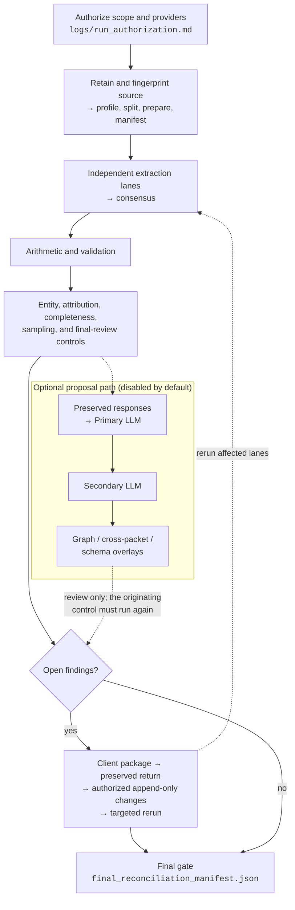

# Technical Documentation

## Purpose and audience

This is the operator and maintainer manual for the Business Document Ingestion
repository. A new operator should be able to use it without prior chat history.
It explains the system boundary, why each gate exists, how a controlled run
moves from source PDFs to approved facts, how to recover from failure, and where
every tunable or artifact contract is defined.

Version 1.0.0 is the stable evidence-control baseline and vendor-neutral
post-review data boundary. This manual also documents backward-compatible work
listed under **Unreleased** in `CHANGELOG.md`; this checkout may include
unmerged development capabilities as identified in `HANDOFF.md`. They are not
part of the immutable 1.0.0 release record until a
later stable version is prepared and tagged. Neither scope is a configured
client production service. Live provider selection, privacy and retention
approval, representative golden-set measurement, target CRM delivery, and
public tenant-isolated retrieval remain client-specific work.

Courtesy credit is recorded in `NOTICE` for Christopher Melhauser and
`theonlymuffinbot`. The latter describes collaborative AI work produced through
a mix of Anthropic Claude Opus 5, OpenAI GPT-5.6 Terra and Sol, and xAI Grok 4.5
models. It is descriptive tooling context, not AI legal authorship or ownership.

## How to use the documentation

This guide owns the end-to-end explanation. More detailed contracts have one
authoritative home:

| Question | Authority |
|---|---|
| What does each environment setting do? | `references/runtime-configuration.md` |
| Which commands and invocation controls exist? | `references/command-line-reference.md`, the complete parser-derived `references/cli-help-catalogue.md`, and each command's `--help` |
| What exact files and fields must a stage read or write? | `references/artifact-contracts.md` |
| What must be true before a phase may advance? | `references/workflow-gates.md` |
| How are records and derived fields modeled? | `references/data-model.md`, `references/extraction-schema.md`, and `references/derived-field-schema.md` |
| How are common CRM import files mapped and safely written? | `references/crm-write-readiness.md` |
| How is the approved-fact MCP/API set up, deployed, accepted, and used? | `skills/mcp-api-operations/SKILL.md` and `references/mcp-production-integration.md` |
| How do image proposals and source-only handoff work? | `skills/record-intake/SKILL.md` and `references/visual-ingestion.md` |
| Which record-write and advanced-analytics features are still planned? | `references/business-data-platform-roadmap.md` |
| How does a specialized lane operate? | Its phase file in `references/` |
| What is the current verified state? | `HANDOFF.md`; `docs/REPOSITORY_AUDIT.md` is a dated historical audit record |

If code, executable help, and prose disagree, stop the run. Preserve all output,
record the inconsistency, and correct the code, tests, and authority document
together.

Examples that use `python` assume the project virtual environment is active.
Run `. .venv/bin/activate`, or substitute `.venv/bin/python`.

# System boundary

## Non-negotiable controls

1. Preserve every source page and original extracted value.
2. Store corrections as evidence-linked amendments; never replace evidence.
3. Emit a record or explicit exception for every input page and failed stage.
4. Require independent evidence for consensus; repeated prompts to one model are
   correlated readings, not independent voters. Independence is a property of the
   model vendor, not the transport, so a router serving another vendor's model
   counts as that vendor.
5. Treat provider confidence as provenance only. It cannot approve a fact and is
   never a term in a decision.
6. Prove applicable arithmetic and report attribution and completeness
   separately. No one result implies another.
7. Keep protected findings in final review. A grouping, dependency, threshold,
   or batch decision cannot clear them.
8. Admit only approved, provenance-linked facts with no open review to canonical
   retrieval and downstream staging.
9. A control that processed nothing has not passed. Empty or unusable input
   produces an explicit exception and a refusal, never a clean result.
10. A value outside its plausible range is a misread figure, not a policy
    question. Route it to review, and never infer a unit, a date order, or a
    country from magnitude alone.
11. Transmission authorization applies only to its named run, source set, and
    configured providers. It never bypasses a phase prerequisite, permits a
    skipped item, accepts a proposal, or authorizes production actions.

## Evidence and approval layers

The controlled progression is:

**immutable source → raw observations → normalized proposals → deterministic
controls → exceptions and decisions → final gate → approved canonical facts →
no-send staging and read-only retrieval**

A failed final gate returns work to exceptions and decisions; it never jumps to
canonical facts.

The layers are intentionally rebuildable:

- **Source** contains byte-retained originals and one-page masters.
- **Raw** contains provider responses, native text, image variants, and other
  direct observations. These are evidence, not facts.
- **Proposal** contains typed readings, mappings, groupings, and amendments with
  source references.
- **Control** contains consensus, arithmetic, validation, entity, attribution,
  completeness, and sampling results.
- **Review** contains every unresolved item and any client or LLM proposal.
- **Canonical** contains only authorized, reconciled, review-clear facts.

Any later layer can be rebuilt from retained earlier evidence. A rerun must use
a new output path and must not erase the prior attempt.

## Implemented lanes and deliberate limits

| Lane | Implemented behavior | Boundary |
|---|---|---|
| Intake | Source hashing, conservative page splitting, ordered provenance, native-text retention, high-signal classification | Uncertain pages remain queued; classification is not production party-role detection |
| Optional visual source intake | Seven schema/image/session/proposal operations over MCP and OAuth JSON API; append-only private journal; local verified source export | Pre-pipeline proposals only; no approval, canonical write, native capture client or automatic extraction handoff |
| Image preparation | Grayscale master plus sibling enhanced/binarized variants | Never replaces the page master; JBIG2 numerics remain suspect |
| LLM extraction | Configured LLM provider; strict schema, raw retention, retries, throttling, cache | One provider per invocation; proposal voter only |
| Table comprehension | Source profile, rows, audit, corpus layout context, bounded rereads | Same-model roles are not consensus; rereads are amendments |
| Document AI | OCR tokens, coordinates, tables, raw page response | Corroborating evidence only; never maps or approves protected facts |
| Google handwriting OCR | Page-complete Cloud Vision OCR, retained renders/raw responses, separately detected region binding | One proposal-only HTR provider-group vote; cannot detect/validate itself or overwrite print |
| Reconciliation | Independent consensus, exact-registry table comparison, arithmetic, deterministic validation | Provider/schema failures and empty records fail closed |
| Handwriting | Independent provider-group HTR-result reconciliation | Financial readings remain review-required amendments; same-provider roles count once |
| Business controls | Entity resolution, configurable attribution, completeness, sampling, descriptive analytics | Missing/ambiguous reconciliation blocks; analytics do not approve facts |
| Page verification | Stratified page sample; each page's image checked against the rows the export claims for it, with lost and invented money named mechanically; corrections graded by the independent evidence beside them and applied as append-only amendments | A correction that would break a line's own base x rate = commission is refused, and one the reviewer alone supports cannot be applied |
| CRM input | Every field exported once with the status that governs it; empty cells filled beside the reading from the run's own evidence and cited public sources; validation against the canonical schema | Not canonical; an inference never overwrites a reading, and a validation finding is a mapping decision, not a repair |
| Dealer locations | Optional Google Places lookup of dealer and brand names, one request per party within a cap, every candidate retained | Business names only; a candidate is accepted only when it accounts for every word of the name, and lands beside the reading as a probable public fact |
| Review reduction | Card reviewer, cross-record search, dataset agent, grouping, safe consolidation, reproducible client package | Presentation and proposal reduction only; source queue remains retained |
| Post-return proposals | Inferred-control artifacts, preserved client-response context, bounded reference discovery, Primary-LLM/independent-Secondary-LLM iterations, and deterministic evidence-graph queries | Never independent consensus, authoritative GL/payment evidence, gate clearance, or fact approval |
| Post-review data | PostgreSQL plan, load plan, atomically verified no-send target package, shared SQLite/MCP/HTTPS CRM query and report layer | Only approved facts; no target CRM receiver or public deployment is implied |

# Installation and repository verification

## Optional source-image intake and handoff

This is a pre-pipeline boundary, not a new independent extraction lane. The
connected vision-capable assistant reads retained PNG/JPEG pages and submits
source-cited candidates against `get_ingestion_schema`. The server makes no
model-provider call and needs no additional model API key. The host model's
self-reported identity is provenance, not an authenticated independent vote.

The existing servers still require an approved non-empty retrieval snapshot,
even for an intake-only caller. Satisfy the Phase 6 activation gate for that
snapshot and obtain separate intake/source-model data-flow authorization. Do
not construct an empty or unfinished snapshot to bypass activation.

### Surfaces and activation parameters

| Surface | Baseline | Intake opt-in |
|---|---|---|
| Local stdio MCP | 12 approved-fact tools; shell launcher | Direct `retrieval_mcp.py` with `--ingestion-dir`; 23 tools |
| Remote OAuth MCP | 14 tools including export jobs | `retrieval_remote_mcp.py --ingestion-dir`; up to 25 tools, scope-filtered |
| TLS/bearer REST | Read-only GET routes | Unchanged; no intake support |
| Remote OAuth JSON API | Intake routes absent | Seven `POST /api/ingestion/{operation}` routes |
| Internal FastAPI sidecar | Private localhost or same-task retrieval/report API | `retrieval_sidecar.py`; no intake support |

`--ingestion-dir` is a private journal directory separate from the repository,
approved snapshot and run. Existing journal/root permissions must be private;
new directories/files use `0700`/`0600`. Local `--ingestion-tenant` defaults to
`local`, and local ownership is fixed to `local-operator`. Remote journal
identity comes from the required `--tenant`; session ownership comes from the
validated OAuth `sub`, never caller arguments. An intake-only identity needs
the applicable `ingestion:read`/`ingestion:submit` scope in addition to all
ordinary audience, role and tenant checks. Neither grants CRM access.

Remote `--max-request-bytes` defaults to 1,000,000 for the entire JSON/base64
envelope. Set at least 14,000,000, with matching proxy/client limits, to transfer
a maximum 10,000,000-byte original image. The shared default rate limit remains
60 requests per rolling minute per client address. Intake adds no environment
setting. Full server arguments remain in executable help and the parser-derived
CLI catalogue; all intake-specific flags and payload fields are defined in
[`Visual Intake`](../references/visual-ingestion.md).

`get_crm_capabilities` describes the immutable approved-fact service, not overall
intake enablement. Remote `/health` and `/docs` show `read_only: false` when
intake is enabled and retain `canonical_read_only: true`.

### Operations, outputs and limits

Read operations are `get_ingestion_schema`, `list_ingestion_sessions`,
`get_ingestion_page`, `get_ingestion_status`,
`list_ingestion_session_reviewers`, `get_ingestion_review_summary`, and
`get_record_proposal`. Submission operations are `create_ingestion_session`,
`upload_ingestion_page`, `submit_record_proposal`, and
`grant_ingestion_session_reviewer`. The JSON API takes the argument object
directly; MCP uses `tools/call`. MCP image retrieval returns ImageContent plus
metadata; the application API returns base64 in `data`. Clients must transfer
real bytes, not ask a language model to construct base64. Native attachment
relay, cross-origin browser upload UI, owner transfer, and admin moderation are
not shipped. A thin same-origin review page is now served at
`/ingestion/review`; it uses the existing intake JSON API with an operator-
supplied bearer token rather than a separate browser auth layer.

The `visual_ingestion_v1` schema reuses controlled extraction header/line fields
and document types. Each observation retains value, raw text, printed/handwritten
source, page number and normalized box in encoded-image orientation. Preserve
unknown labels as `unmapped_fields`, unresolved readings as null plus issues,
and unreadable pages as explicit exceptions. Every declared page is accounted
for; zero extracted records cannot validate successfully. Approval/control
fields are forbidden. Structural validation proves neither reading accuracy
nor independent consensus. All outcomes remain unapproved and unpublished.

For a co-located internal application, `retrieval_sidecar.py` provides a thin
`FastAPI` wrapper over `crm_service.py`. It binds one immutable approved-fact
SQLite snapshot resolved from `RETRIEVAL_DB_URL`, `RETRIEVAL_ARTIFACT_ROOT`, or
an explicit `--database` argument, and is intended for localhost or same-task
container use rather than public internet exposure. Its contract is `GET /health`,
`GET /capabilities`, and POST JSON routes for account cards, record
search/query, sales analysis, and standard reports.

Limits are 1-20 pages/session; single-frame PNG/JPEG only; 10 MB original bytes
and 25 million pixels/image; 1 MB canonical JSON/proposal; 100 records/proposal;
200 lines/record; 100 unmapped fields and 100 issues/record; 4,000 characters per
observation value/raw reading and 1,000 per issue/page-exception reason. The
journal allows 10,000 entries and 250 MB accounted payload/result/image bytes,
with a conservative 1 MB result reservation per insert; a session allows 100
page/proposal entries including rejections. These fixed decimal-byte bounds
are not tuning flags or physical disk-size guarantees.

The journal retains bounded corrupt/unsupported image attempts and rejected
proposals. Malformed/oversized requests and exhausted quotas are refused before
acceptance; the sender retains originals and refusal receipts. Exact-key/input
replay returns the original receipt across restart and API/MCP. Changed content
needs a new key. A corrected proposal appends; replacing an accepted image slot
requires a new session. A later proposal never clears an earlier finding.
HTTP 200 can carry a retained rejection: inspect `status` and `findings`.

### Source export and pipeline re-entry

The local `visual_ingestion_export.py` utility opens an existing journal
read-only and snapshots one owner/session. `export` requires positional journal
directory, `--tenant`, `--owner`, `--session-id` and new `--out-dir`; no defaults
or overwrite/resume are supplied. Local OS permissions grant operator access;
`--owner` selects the session and is not remote authentication. Invoke export
through a fresh `run_workspace.py` root and use absolute script/interpreter
paths. Journal and destination must not overlap.

The `visual_intake_source_package_v1` output preserves every upload's original
bytes in `originals/*.bin`, all payloads/receipts/proposal versions in
`journal.json`, final-review `exceptions.json`, and a completion `manifest.json`
binding every path, size, checksum, count and transformation. A complete usable
source set additionally produces `visual_<session-identity-hash>.pdf`; its page
map matches the real intake producer's stable IDs. Never rename that PDF.

PDF preparation keeps encoded orientation and page order, does no EXIF rotation,
crop, resize or OCR, converts display pixels to RGB with transparency on white,
and applies no ICC correction. Original bytes remain authoritative. Its 300-DPI
layout is not evidence of physical dimensions or original scan resolution.
Preparation is capped at 50 million total pixels. Inspect all pages visually.

Keep the export receipt separately. `verify PACKAGE --manifest-sha256 HASH`
requires that receipt's exact manifest SHA-256, not a newly computed untrusted
hash. It checks inventory, safe paths, symlinks, file/entry integrity and size
bounds (1 MB manifest; 250 MB/file). Export and verify exit 0 only for
`source_prepared_review_required`; exit 2 retains blocked source preparation,
including an otherwise byte-intact archive; exit 1 indicates refusal/error.
Incomplete directories and failed partial PDFs remain preserved, never resumed
or used. Retry into a new directory. Hashes are not privileged-actor signatures.

Only a verified package with a declared non-null `source_pdf` proceeds to
`scan_profile.py`, then `ingest_pages.py`, under the run wrapper. Bind the full
source package and derivative in operations provenance and include its
`exceptions.json` with every later review-bearing artifact. Continue the normal
ordered extraction and control sequence. No host-model proposal is promoted
to a producer-authenticated extraction handoff or independent consensus vote.

Repository intake tests and the source-handoff tests supplement the six-gate
disabled-intake acceptance. Deployment additionally needs real TLS/OAuth/client
upload, image reading, quota/retry/restart, backup/restore and revocation tests.
Record writes, publication, native capture and expanded analytics remain
explicit roadmap work, not capabilities proved by code coverage.

## Dependencies

- Python 3.12 or newer.
- Development packages from `requirements-dev.txt`.
- Poppler tools (`pdfinfo`, `pdftotext`, `pdftoppm`) for acceptance and visual
  verification.
- Tectonic 0.17.0 for deterministic tracked PDF generation.

On macOS, `brew install poppler tectonic` supplies the document tools. In other
environments, use an approved package source and verify the selected Tectonic
version before release generation.

## Full quality gate

Use the wrapper in a normal terminal or CI worker. It deliberately has no
interactive-output deadline; the workflow's 45-minute CI job timeout is the
separate safety boundary. A tool that stops displaying output does not make the
underlying command incomplete—wait for its process exit status or run this
wrapper directly:

```bash
PYTHON_BIN=.venv/bin/python bash scripts/quality_gate.sh
```

The expanded sequence below prepares the environment, then reproduces the
wrapper's checks. The suite runs once under branch coverage; a separate bare
pytest pass is not part of the wrapper.

```bash
python3 -m venv .venv
.venv/bin/python -m pip install -r requirements-dev.txt
.venv/bin/python -m pip check
quality_tmp_dir="$(mktemp -d)"
COVERAGE_FILE="$quality_tmp_dir/.coverage" PYTEST_ADDOPTS="-p no:cacheprovider" \
  .venv/bin/python -m coverage run --branch -m pytest
COVERAGE_FILE="$quality_tmp_dir/.coverage" \
  .venv/bin/python -m coverage report --fail-under=100
RUFF_CACHE_DIR="$quality_tmp_dir/ruff-cache" .venv/bin/ruff check .
RUFF_CACHE_DIR="$quality_tmp_dir/ruff-cache" \
  .venv/bin/ruff format --check scripts tests
.venv/bin/python scripts/release_check.py
rm -rf "$quality_tmp_dir"
```

The required threshold is 100% statement and branch coverage for `scripts/`.
The release check also verifies required documents, local links, tracked
Markdown/LaTeX/PDF synchronization, repository hygiene, complete environment
documentation, and the complete argparse command index.

# Configuration

## Precedence and reproducibility

Copy `.env.example` to the Git-ignored root `.env`. Effective settings resolve
in this order:

1. Explicit command-line option.
2. Process environment, CI variable, or secret-manager injection.
3. Repository-root `.env`, unless the process exports
   `BUSINESS_DOCUMENT_IGNORE_PROJECT_ENV` as true.
4. Safe code default.

Use `operations.py manifest --config-from-env` for a live run. It records the
effective non-secret configuration visible to the process. Secret values are
redacted; credential-variable names are retained. Paths and client inputs stay
on the command line because they are run evidence, not shared configuration.

`references/runtime-configuration.md` documents every tracked environment
setting individually: default, range or allowed values, effect, security
boundary, and change guidance. It also documents the process-only
`PYTHON_BIN`, `BUSINESS_DOCUMENT_RETRIEVAL_DB` and
`BUSINESS_DOCUMENT_IGNORE_PROJECT_ENV` variables, which are deliberately not
stored in `.env`; the last switches the root `.env` off for a process and the
children it starts. `references/command-line-reference.md`
indexes every CLI and subcommand. Its companion
`references/cli-help-catalogue.md` is the complete flag-level technical
appendix: it reproduces every command and subcommand's positional inputs,
options, defaults, choices, and help text from the live parser. Only `usage:`
line wrapping is normalized across supported CPython versions; the executable's
`--help` remains the exact runtime display. The release gate fails if the
catalogue drifts. The exact parser help is available with:

```bash
python scripts/COMMAND.py --help
python scripts/COMMAND.py SUBCOMMAND --help
```

## Provider and lane selection

The run-level registry separates these roles:

- `LLM_EXTRACT_PROVIDER` selects the ordinary extraction provider.
- `LLM_CONSENSUS_PRI_PROVIDER` and `LLM_CONSENSUS_SEC_PROVIDER` select two
  separately invoked, genuinely independent consensus lanes.
- `LLM_REASONING_PROVIDER` selects proposal-only reasoning lanes.
- `LLM_CLIENT_REVIEW_PROVIDER` may override the card reviewer.
- `LLM_POST_REVIEW_PROVIDER` may override both post-review reasoning lanes.
- `AI_SIMULATED_CLIENT_REVIEW_PROVIDER` selects the separate simulated-client
  draft-comment lane; its selected model and all retry/packet controls use the
  corresponding `AI_SIMULATED_CLIENT_REVIEW_*` settings.

Each provider resolves its model from the corresponding extraction, consensus,
or reasoning model setting. The final reviewer can take invocation-only
`--final-provider` and `--final-model` overrides, but all context, timeout,
retry, reasoning, and safety controls remain inherited. A model change requires
schema/capability verification and representative golden-set evaluation.

Shared throttling uses provider request/token ceilings, a safety ratio, an
inter-request interval, and preflight request-size bounds. Concurrency changes
throughput, not approval. An oversized packet fails before network I/O. A
terminal reviewer rate limit opens a circuit breaker so remaining cards are
retained without further calls.

## Credentials

Do not store a provider response, token, API key, service-account JSON value, or
credential file in `.env`, a run directory, a handoff, or version control.
`.env` may contain approved API-key values for local execution, but it is not a
secret manager and must remain private. Prefer external injection.

Before a Google-backed run:

```bash
python scripts/reauthorize_google.py
```

The helper refreshes gcloud user credentials and Application Default
Credentials, verifies both token paths, optionally offers to enable required
APIs, and can write short-lived Document AI and Cloud Vision token variables to
a user-selected `0600` file outside the repository. If
`GOOGLE_APPLICATION_CREDENTIALS` is set, verify
that it points to the intended external file; otherwise Vertex uses refreshed
ADC.

# Run layout and artifact discipline

Use a dedicated directory per run. Initialize it with
`python scripts/run_workspace.py init RUN_DIR`; then run every writing command
through `python scripts/run_workspace.py run RUN_DIR -- ...`. The wrapper makes
`RUN_DIR/...` (and the operations guides' `RUN/...`) workspace-relative,
rejects declared output-path escapes, and pins LLM cache and throttle state to
`RUN_DIR/runtime/`. Source inputs and credentials intentionally remain outside
the run root as read-only boundaries. A practical layout is:

```text
RUN_DIR/
  pages/                  retained one-page masters and source copies
  providers/              normalized records, handoffs, raw responses, and exceptions
  tables/                 source-native table profile and corpus artifacts
  htr/                    handwriting images, annotations, and decisions
  controls/               consensus, arithmetic, validation, and reconciliation
  templates/              observed source templates and drift artifacts
  graph/                  evidence-graph overlays
  relationships/          retained relationship-proposal passes
  review/                 exhaustive queue and proposal-only review artifacts
  client/                 context, issued package, and preserved returned copy
  analytics/              local analysis outputs
  canonical/              approved export, load plan, staging, and retrieval DB
  delivery/               reproducible delivery package artifacts
  runtime/                per-run cache and throttle state
  retries/                no-clobber recovery overlays
  logs/                   initialization, command ledger, and audit artifacts
```

Operational manifests, adapter contracts, privacy inventories, reviewer
exports, client packages, deployment/load plans, and retrieval stores are
no-clobber. Resumable stage state is the intentional exception: it updates
atomically and remains bound to the same manifest hash. Exact filenames and
schemas are in `references/artifact-contracts.md`.

Before the first provider call for a full run, retain a non-secret
`RUN_DIR/logs/run_authorization.md` with the run identifier, source
identifiers/hashes, timestamp, selected lanes, provider families, and whether
every in-scope source item may be sent. This records transmission scope only;
it does not accept a proposal, clear a control, enable auto-accept/carry-forward,
or authorize canonical, CRM, or delivery work. Execute phases as a strict state
machine: complete and inspect upstream artifacts before starting a dependent
lane, run only genuinely independent same-phase lanes in parallel, and retain
every refusal, schema mismatch, provider failure, missing prerequisite, or
zero-coverage result. At closure, run workspace audit and required lane coverage
before building the final queue from all review-bearing base and recovery
artifacts.

Use relative output paths inside the wrapper, for example:

```bash
python scripts/run_workspace.py run RUN_DIR -- \
  python /ABSOLUTE/REPOSITORY/PATH/scripts/scan_profile.py SOURCE \
  --out profile.json
```

# Operating runbook

The examples below show control order. Replace placeholder paths with a new
authorized run directory. Use each command's `--help` before execution.



This is an evidence and control flow, not a data-overwrite flow. Every optional
LLM result remains a retained proposal until the normal authorization and
downstream-control path completes.

## 1. Discover and authorize

Before receiving client data, complete `docs/CLIENT_USER_GUIDE.md`:

- source owner, transfer route, dedicated source area, and retention/deletion;
- corpus size, date range, document families, scan characteristics, and known
  duplicate behavior;
- business questions, attribution definition, GL/payment/reference exports;
- approved providers, regions, credentials, request/cost caps, and caching;
- golden-set design, acceptance thresholds, client reviewer, and target system;
- whether retrieval remains local or needs separately accepted remote controls.

Do not begin live provider work until privacy, residency, and provider approval
are explicit.

## 2. Profile, retain, split, and prepare

```bash
python scripts/scan_profile.py SOURCE --out RUN_DIR/operations/scan_profile.json
python scripts/ingest_pages.py SOURCE.pdf --out RUN_DIR/intake
python scripts/reassemble_pages.py RUN_DIR/intake/ingestion_manifest.json \
  --out RUN_DIR/controls/reassembly.json \
  --exceptions RUN_DIR/review/reassembly_exceptions.json
python scripts/preprocess_pages.py RUN_DIR/intake/pages \
  --out RUN_DIR/preprocessing \
  --manifest RUN_DIR/preprocessing/preprocessing_manifest.json
```

The source is never modified. Inspect page counts, hashes, relative paths,
one-page boundaries, order, scan warnings, reassembly proposals, duplicate
candidates, and all classification exceptions before extraction.

## 3. Create the run manifest and state

```bash
python scripts/operations.py manifest \
  RUN_DIR/intake/ingestion_manifest.json \
  --config-from-env --out RUN_DIR/operations/run_manifest.json
python scripts/operations.py stage RUN_DIR/operations/run_state.json profile \
  --manifest-hash MANIFEST_SHA256
python scripts/operations.py stage RUN_DIR/operations/run_state.json intake \
  --manifest-hash MANIFEST_SHA256
```

Keep the manifest hash constant for resumed stages. A changed input or effective
configuration requires a new run.

## 4. Produce independent extraction evidence

Invoke the primary and secondary lanes separately:

```bash
python scripts/llm_adapter.py RUN_DIR/intake/ingestion_manifest.json \
  --lane consensus_primary \
  --out RUN_DIR/providers/primary_engine.json \
  --adapter-out RUN_DIR/providers/primary_handoff.json \
  --exceptions RUN_DIR/review/primary_exceptions.json \
  --raw-dir RUN_DIR/providers/primary_raw

python scripts/llm_adapter.py RUN_DIR/intake/ingestion_manifest.json \
  --lane consensus_secondary \
  --out RUN_DIR/providers/secondary_engine.json \
  --adapter-out RUN_DIR/providers/secondary_handoff.json \
  --exceptions RUN_DIR/review/secondary_exceptions.json \
  --raw-dir RUN_DIR/providers/secondary_raw
```

The two lane providers must be genuinely independent. Validate each adapter
handoff and retain every raw response and exception. Two empty or failed engine
records are never agreement.

For source-native tables, follow `references/table-comprehension.md`. Profile
layout, propose source rows with cell evidence, run the non-independent audit,
optionally invoke Document AI for a conditional buddy audit, then map only with
an exact client-approved registry. Corpus refinement is sequential because
source-layout context is order-dependent. Every changed reread is a linked
amendment proposal.

## 5. Reconcile and validate

```bash
python scripts/consensus.py \
  RUN_DIR/providers/primary_engine.json \
  RUN_DIR/providers/secondary_engine.json \
  --out RUN_DIR/controls/consensus.json \
  --exceptions RUN_DIR/review/consensus_exceptions.json
python scripts/arithmetic_check.py RUN_DIR/controls/consensus.json \
  --out RUN_DIR/controls/proofed.json
python scripts/adjudicate.py RUN_DIR/controls/proofed.json \
  RUN_DIR/providers/primary_engine.json \
  RUN_DIR/providers/secondary_engine.json \
  --out RUN_DIR/review/amendment_proposals.json \
  --exceptions RUN_DIR/review/adjudication_exceptions.json
python scripts/validate_extraction.py RUN_DIR/controls/proofed.json \
  --out RUN_DIR/controls/validated.json \
  --exceptions RUN_DIR/review/validation_exceptions.json
```

Consensus accepts only `independent_extraction_handoff_v1` artifacts from
distinct provider groups and consensus lanes. It verifies embedded record and
retained raw-response hashes, compares typed values without coercing identifiers
into numbers, rejects duplicate engine/document records, and carries a voted document type or
`unknown`. Arithmetic compares source-visible equations within the configured
absolute tolerance. Adjudication is bounded and amendment-only. Validation
never silently normalizes a failed field into passing status.

### Source-template observations

Three lanes read a source-template observation artifact and nothing else
produces one: `schema_discovery.py discover`, `allocation_policy.py discover`,
and `template_drift.py analyze`. Build it here, from the completed consensus
run, or those lanes cannot run at all.

```bash
python scripts/template_observations.py RUN_DIR/controls/consensus.json \
  --out RUN_DIR/templates/observed_templates.json \
  --exceptions RUN_DIR/templates/observed_template_exceptions.json
```

A template is one document family, not one page. Labels are the union of what a
family's documents showed, each carrying the number of documents it appeared in,
so capture variance stays visible instead of producing one template per page.
Labels are copied exactly as printed and ordered deterministically rather than
in layout order, so drift detection sees an added or removed label and not a
reordering. Nothing here is a mapping.

This is also why template drift is computed after consensus rather than in
Phase 2: its input does not exist until extraction has run. A changed vendor
layout is therefore detected after that layout has been extracted.

## 6. Run business controls

```bash
python scripts/address_normalize.py RUN_DIR/controls/validated.json \
  --out RUN_DIR/controls/address_normalized.json \
  --exceptions RUN_DIR/review/address_exceptions.json
python scripts/entity_resolve.py RUN_DIR/controls/address_normalized.json \
  --out RUN_DIR/controls/parties.json \
  --log RUN_DIR/controls/entity_merges.json
python scripts/attribution.py RUN_DIR/controls/proofed.json \
  --reference REFERENCE_EXPORT \
  --out RUN_DIR/controls/attributed.json \
  --register RUN_DIR/review/unattributable.json
python scripts/completeness.py RUN_DIR/controls/attributed.json \
  --gl GL_EXPORT --payments PAYMENT_EXPORT \
  --out RUN_DIR/controls/completeness.json
python scripts/sampling.py RUN_DIR/controls/attributed.json \
  --materiality MATERIALITY --out RUN_DIR/controls/sample_plan.json
```

Name the client with `entity_resolve.py --client-name`, as the pages print it,
or the client becomes its own largest counterparty. Give `--party-decisions` a
person's decisions about named pairs -- `same_party`, `branch_of` (both
accounts kept, the branch linked to its parent), `different_parties` and
`not_a_party` -- under the authorization the file names. A decided pair leaves
pending adjudication with its score kept, and a decision the resolver cannot
apply is reported with its reason rather than guessed at.

### Recovering a printed column the schema had no field for

A schema that names no home for a printed column does not make an engine skip
it: the value goes into whichever field looks closest, both vendors pick the
same one, and it arrives accepted. Before proposing a re-extraction to capture
such a column, reconcile from what the run already retains. Every provider
response is kept, and the independent non-LLM extractor retains the whole page
rather than the fields the schema asked for.

```bash
python scripts/specifier_recover.py RUN_DIR/controls/validated.json \
  --extractor-raw RUN_DIR/providers/raw/docai \
  --out RUN_DIR/controls/records_with_specifiers.json \
  --exceptions RUN_DIR/review/specifier_recovery_exceptions.json
```

The join is a printed key both sides already carry -- these forms group lines
under a header reading COMPANY / ACK# / P.O.# / P.O. DATE / SPECIFIER, so the
specifier printed beside a purchase-order number belongs to every line quoting
it. A recovered reading is one extractor with no model behind it, so it is
written unaccepted as a single reading and never carries the corroboration
status that pairs a model with an extractor. A line already stating a specifier
keeps its own, and a page printing a specifier no line claims yields an
exception rather than a guess.

Every lane reading the extractor's pages indexes them through
`run_io.retained_responses`, which takes the response that read the page. A
request that came back without text is retried and both files are kept, and on
the commission run 222 of 716 pages had text only in the retry: indexing the
first file per page left all 222 empty to brand recovery, to this lane and to
the page review's extractor evidence.

`brand_recover.py` recovers the manufacturer the same way, from the retained
page rather than a new call. It reads the letterhead first -- the name at the
top wins when a letterhead names two, and a name of ten letters or more may be
read one letter off -- then gives a page naming no maker the one its opening
shares with that maker's other pages. A continuation page prints its maker's
columns and none of its letterhead, so a page still unsettled takes the maker
only whose settled pages print at least three of its words, or else the maker
every one of its five most alike settled pages names. A page whose top names a
company by its legal form, neither the client nor a known maker, stays an
exception naming that company: Crestline Design's funds-transfer advices read
like Marlow/Bramwell's bill payments, and a test over the pages the vocabulary
already knows cannot see a maker it lacks.

After reviewing every certainty and MUS selection, provide a
`sample_review_results_v1` artifact containing the plan's
`sample_plan_sha256` and exactly one explicit outcome per selected document.
Missing, duplicate, foreign, stale, abstained, failed, or contradictory outcomes
block the accuracy statement; an empty file is never a zero-error result.

Address processing is local unless Google Address Validation is explicitly
enabled. Provider results add derived evidence and never replace the raw
address. Entity merges are reversible. Attribution enumerates every unresolved
in-scope dollar. Completeness blocks on missing or unmeasurable reconciliation
inputs, out-of-tolerance periods, unresolved/ambiguous payments, sequence or
calendar gaps, and undated documents.

Run `handwriting_review.py` only with independent HTR results. Printed and
handwritten evidence remain separate. Handwritten financial readings require
strict reconciliation and still become review-required amendments.

The optional Google handwriting lane uses Cloud Vision's handwriting-capable
`DOCUMENT_TEXT_DETECTION` feature on every retained page. Supply one or more
separately produced extraction/profile artifacts containing normalized
`handwriting_regions`; Google reads those regions but does not prove that its
own reading is correct:

```bash
python scripts/google_handwriting_ocr.py \
  RUN_DIR/intake/ingestion_manifest.json \
  --regions RUN_DIR/extraction/primary_records.json \
  --out RUN_DIR/handwriting/google_htr.json \
  --adapter-out RUN_DIR/handwriting/google_htr_adapter.json \
  --exceptions RUN_DIR/handwriting/google_htr_exceptions.json \
  --raw-dir RUN_DIR/handwriting/google_htr_raw \
  --images-dir RUN_DIR/handwriting/google_htr_pages --enable
```

Every page receives one success/failure record. A page without a supplied
region is recorded as OCR-complete but not declared handwriting-free. Freeze
the raw response and rendered-page directories. Retry provider failures in a
new directory, then reconcile the resulting `google_htr.json` with genuinely
separate HTR provider groups. The other inputs may be HTR annotation artifacts
or retained visual-extraction record lists; each region/reading pair must share
the same stable `region_id`:

```bash
python scripts/handwriting_review.py \
  RUN_DIR/handwriting/google_htr.json \
  RUN_DIR/extraction/openai_records.json OTHER_PROVIDER_HTR.json \
  --out RUN_DIR/handwriting/decisions.json \
  --exceptions RUN_DIR/handwriting/exceptions.json
```

Three independent groups must unanimously agree on handwritten numerics; two
independent groups suffice for free text. Same-provider models and prompt roles
count once. Signatures and financial amendments remain review work.

## 7. Build and reduce the review surface safely

Three options here are omissions rather than refinements, and each fails
quietly. `--resolved-by` retains a document-type proposal the run already
answered instead of asking it again; without it a real corpus re-asked 1,121
settled questions. `--classifications` gives grouping the document type the
extraction consensus declined to claim -- it writes `"unknown"` wherever its
lanes could not agree, which was 691 of 718 documents on a real corpus, and
without the classification artifact those become one undifferentiated
`unclassified_document_family` group and the family is guessed from words in the
reason string. The pack lane needs both, because it builds the same queue by its
own path.


```bash
python scripts/final_review_queue.py RUN_DIR/review/*.json \
  RUN_DIR/controls/validated.json \
  RUN_DIR/controls/completeness.json \
  --resolved-by RUN_DIR/controls/classification_consensus.json \
  --out RUN_DIR/review/final_client_review.json
python scripts/review_grouping.py RUN_DIR/review/final_client_review.json \
  --consensus RUN_DIR/controls/consensus.json \
  --classifications RUN_DIR/controls/classification_consensus.json \
  --out RUN_DIR/review/grouping.json
python scripts/client_review_lane.py build RUN_DIR/review/*.json \
  --consensus RUN_DIR/controls/consensus.json \
  --classifications RUN_DIR/controls/classification_consensus.json \
  --resolved-by RUN_DIR/controls/classification_consensus.json \
  --manifest RUN_DIR/pages/ingestion_manifest.json \
  --out-dir RUN_DIR/review/client_pack_01
python scripts/operations.py review-export \
  RUN_DIR/review/final_client_review.json \
  --csv RUN_DIR/review/final_client_review.csv \
  --html RUN_DIR/review/final_client_review.html \
  --xlsx RUN_DIR/review/final_client_review.xlsx
```

The JSON queue is authoritative. CSV, HTML, and XLSX are reviewer aids. The
card-level reviewer, cross-record pass, full-dataset agent, grouping, and safe
consolidation are optional and disabled by default. They retain the original
queue and may reduce only the client-facing presentation of explicitly eligible
low-risk dependencies.

All review-reduction paths use the shared fail-closed protected-item taxonomy.
Unknown reason codes are protected. Cross-record proof must come through the
strict `cross_record_evidence_v1` envelope and one exact versioned producer
handoff. `intake_evidence_producer_v1` binds the complete intake manifest,
classification-exception artifact, retained source/page/text files, and
operations manifest. The reducer reruns the retained deterministic text
extraction and classifier and admits only rule-classified
`pages[].document_type`. `canonical_evidence_producer_v1` binds the exact
canonical export to its checksummed load plan, clear final-review artifact,
source PDFs, and operations manifest; only
`tables.document[].document_type` is eligible. Extra semantic fields,
self-labelled tuples, arbitrary JSON, malformed entries, raw/provider update
fields, suggestions, and unresolved or non-clear facts are reported as
ineligible context.

Evidence preflight is local and precedes provider I/O. By default each envelope
or required producer/source artifact is capped at 10,000,000 bytes and the
supplied collection is capped at 10,000 declared entries. Positive overrides
are available through `--max-evidence-artifact-bytes`,
`--max-evidence-entries`, and their documented environment settings. A breach
emits an explicit review exception without a provider call. The reducer first
size-bounds and parses every envelope and totals all declared entries; no
producer is loaded when the aggregate limit fails. Every producer, handoff,
source PDF, page PDF, and retained text file is size-checked before its first
hash, open, or read. Producer indexes are built once; authenticated source
hashes, PDF validity, and page counts are cached so repeated entries read and
open each retained source once. Even an empty collection reports an invalid
producer once at `$.producer`; for a non-empty invalid producer, every declared
entry is separately retained, with otherwise valid entries marked
`producer_not_authenticated`.

A proposed update must target the reviewed field, use exact non-empty
whitespace-free target and different source identities, pass finite non-Boolean
`[0, 1]` confidence validation, and resolve one entry. Every failure remains
review work with a machine reason. Eligible updates remain proposal-only and
record the exact envelope, producer, and source provenance. Protected findings,
including provider/schema, arithmetic, reassembly, handwriting, identity,
review-flag, missing-field, and unresolved-evidence items, cannot be batch
cleared.

When authorized and calibrated, run `safe_review_consolidation.py` into a fresh
directory. With grouping enabled it generates the small reproducible workbook,
plain-language guide, decision pages, and ZIP. The package intentionally has no
client appendix or drill-down; the internal JSON retains the exhaustive detail.

## 8. Process a returned client workbook

Preserve the issued workbook and the returned copy separately. Import them
together:

```bash
python scripts/client_review_package.py import-decisions \
  RETURNED.xlsx --issued-workbook ISSUED.xlsx \
  --out RUN_DIR/review/client_decisions.json
```

The importer validates package structure, hidden safe-consolidation lineage, group completeness/order, fixed
cells, controlled choices, protected decisions, editable columns, notes for
client-supplied alternatives, ZIP safety limits, and both workbook hashes. Its
output is proposal-only.

If the returned workbook is legacy or otherwise blocked by lineage, preserve
the exact client choices and notes before troubleshooting the package:

```bash
python scripts/client_review_package.py preserve-responses \
  RETURNED.xlsx --issued-workbook ISSUED.xlsx \
  --out RUN_DIR/review/client_responses_preserved.json
```

This no-clobber, proposal-only artifact records every decision row, response
count, workbook hashes, fixed-cell comparison, and any lineage exception. It
does not alter either workbook and should accompany any reissued package.

When an authoritative client reference, GL, or payment export is missing, keep
that control explicitly blocked. An operator may create a separate, hash-bound
proposal package to prioritize follow-up, but it cannot turn the completeness
gate clear:

```bash
python scripts/inferred_controls.py RUN_DIR/controls/consensus_or_proofed.json \
  --out-dir RUN_DIR/review/inferred_controls_proposal
```

For bounded post-return reference reasoning, first construct context from the
preserved response artifact and a deterministic selection of retained records:

```bash
python scripts/client_review_context.py \
  RUN_DIR/review/client_responses_preserved.json \
  --records RUN_DIR/controls/consensus_or_proofed.json \
  --out RUN_DIR/review/client_review_context.json
```

If the client supplied comments outside the returned workbook, parse one or
more general comment files into the same context contract, then include the
result in source-native corpus forward and refinement calls:

```bash
python scripts/client_input_comments.py client_notes.json client_followup.csv \
  --out RUN_DIR/review/client_input_comments_context.json
python scripts/table_comprehension_corpus.py \
  RUN_DIR/intake/ingestion_manifest.json \
  --client-context RUN_DIR/review/client_input_comments_context.json \
  --out RUN_DIR/tables/corpus_with_client_context
```

JSON may be a list or an object containing `comments[]`; CSV/TSV requires a
`client_comment`, `comment`, `comments`, `note`, or `text` column; TXT and
Markdown preserve each non-empty line. Every comment and source field remains
verbatim and hash-bound. It may guide terminology, priorities, and questions,
but cannot supply document facts, independent consensus, authorization, or
control clearance. The context hash is part of resumable corpus identity.

The context marks every client comment as reasoning-only and excludes it from
independent consensus. The legacy one-pass discovery lane
(`client_review_inference.py`) and the preferred iterative lane are both
disabled unless explicitly invoked. The iterative lane uses a configured Primary
LLM and independently configured Secondary LLM, retains raw responses and a record-level
exception for any item that cannot fit its bounded packet, and accepts the
full retained corpus only through `--records`:

```bash
python scripts/client_review_iterative.py \
  RUN_DIR/review/client_review_context.json \
  --primary-out RUN_DIR/review/iterative_primary.json \
  --buddy-out RUN_DIR/review/iterative_buddy.json \
  --exceptions RUN_DIR/review/iterative_exceptions.json \
  --raw-dir RUN_DIR/review/iterative_raw \
  --records RUN_DIR/controls/consensus_or_proofed.json --iterations 3 \
  --convergence-min-new-candidates 1
```

The lane adapts serialized packet boundaries and reserves 40,000 bytes for
instructions, carried proposals, and buddy decisions; it retains every raw
request and response, and writes exact `source_document_ids` into every
exhausted batch exception. Retries are bounded; recovery uses a separate,
no-clobber retry run
for the named records, and any residual remains explicit review work. Its
`confirmed` and `close_needs_review` states are still source-linked
proposals only. They cannot establish GL/payment facts, approve attribution,
clear completeness, or authorize a canonical fact. Build the deterministic
JSON evidence graph from the selected, hash-bound artifacts when graph queries
will help a reviewer; its `build`, `query`, `path`, `candidates`,
`contradictions`, `schema`, and `schema-surface` commands preserve evidence and
conflicts rather than resolve them. The bounded `schema` inventory reports
observed field names, counts, examples, and claim provenance for proposal-only
schema discovery. `schema-surface` reads an exact retained consensus artifact
and separately reports non-consensus candidate fields, source pointers, and
label-bound address/contact/representative signals. It retains all raw signals
and provides only a bounded, source-cited signal summary to schema discovery; it never turns a candidate
into a graph fact or canonical mapping. See `references/artifact-contracts.md`
and `references/command-line-reference.md` for the exact artifact manifest and
CLI contracts.

The extraction contract has a broad controlled core for commercial references,
party/contact roles, payment/tax, sales, commission, and logistics fields. It
also requires a source-labelled extension record for every other visible labeled
value. This gives unfamiliar document families a retained, source-cited path
into schema review instead of discarding an out-of-vocabulary field. The
extension is proposal-only: a later mapping still needs evidence and approval.

The iterative primary/buddy provider, model, optional credential-variable
override, timeout, retry, backoff, reasoning effort, and packet limits are all
read from `.env` and recorded in the outputs. The code rejects a missing model,
unsupported provider, or matching primary/buddy provider before provider I/O;
safe code validation never silently selects a provider for a production run.

To propose next steps for retained reassembly, validation, or attribution
exceptions, use the separate disabled-by-default control-exception lane. It
receives immutable records, named control findings, and—when client feedback is
available—the preserved `client_review_context_v1` as reasoning-only context.
It uses configured independent primary and buddy providers, preserves raw
responses, and never changes the source records or clears a gate:

```bash
python scripts/client_review_exception_resolution.py \
  RUN_DIR/controls/consensus_or_proofed.json \
  --exceptions RUN_DIR/controls/arithmetic.json \
  --exceptions RUN_DIR/controls/validation_exceptions.json \
  --exceptions RUN_DIR/controls/attribution_register.json \
  --client-context RUN_DIR/review/client_review_context.json \
  --out RUN_DIR/review/exception_resolution_proposals.json \
  --exceptions-out RUN_DIR/review/exception_resolution_exceptions.json \
  --raw-dir RUN_DIR/review/exception_resolution_raw --enable
```

This lane uses the shared serialized-byte adaptive packet utility. It combines
all supplied findings for one source record, reduces packet size before provider
I/O, and records any individually oversized record or positive batch-cap
remainder explicitly. It rejects duplicate record IDs, accounts for findings
whose source record is absent, and gives the buddy reviewer the same findings,
source records, and reasoning-only client context as the primary reviewer. A
primary proposal is retained as rejected if its document or related-document ID
falls outside the packet or its evidence quote is not present in the compact
source packet. Review and apply only eligible append-only proposals, then rerun
reassembly, arithmetic, validation, attribution, completeness, and final review.
Inferred document evidence cannot clear authoritative GL or payment/remittance
reconciliation. Every input finding has an exception ID, and every retained
proposal names the source exception IDs it addresses so later overlays can be
reconciled without guessing from batch membership.
Provider/schema failures, individually oversized work, and cap-deferred work
also retain the exact original findings, control kinds, and exception IDs.
Passing that companion exception artifact to a new no-clobber recovery therefore
reconstructs the original control packet rather than substituting a generic
provider-failure finding or guessing from document membership.

### AI simulated-client review comments

`scripts/ai_simulated_client_review.py` is intentionally separate from both the
client workbook import and the client-review reduction lane. It accepts a final
review queue, retained source-evidence artifacts, and optional JSON context artifacts, then asks one configured LLM
to produce a source-cited draft recommendation for every item in each card. The
default configuration selects OpenAI `gpt-5.6-luna`, but the provider and model
are environment-configured and retained in the output; there is no hard-coded
provider decision in the lane.

The package contains authoritative comment JSON, a separate exception artifact,
one raw response per card, and derived CSV/XLSX reviewer views. Every generated
comment begins **“AI client reviewed (simulated; not client authorization)”**.
The provider packet stores each source record once and gives every review item
its own source-reference list. The reducer validates each evidence quote within
one scalar value of a source record assigned to that item, retains the exact
artifact-scoped reference and JSON pointer, preserves invalid responses separately, and creates a
comment or explicit exception for each final-review item. It automatically keeps
all protected findings in human review even when the model recommends a
simulated acceptance.

Context clipping is measured in UTF-8 bytes. The raw directory contains an
atomic checkpoint bound to the queue, evidence hashes, and complete resolved
non-secret configuration. `--resume` continues only unfinished cards when all
bindings still match. After completion, `--retry-exceptions` creates a separate
no-clobber recovery overlay for retained provider/schema, size, cap,
missing-source, or explicit post-run evidence-audit cards. It never overwrites
or silently merges the frozen base.

This is decision support, not delegated authority: it does not modify the
issued or returned workbook, impersonate a client, authorize an amendment,
clear a deterministic control, satisfy unavailable GL/payment evidence, or
allow canonical/CRM staging. A real client or authorized operator must make a
separate decision, authorise a specific append-only change, and rerun the
affected controls.

If an operator intentionally stops a later pass after earlier passes complete,
do not rerun the earlier provider calls or overwrite their raw evidence. Write
new final artifact paths and use `--finalize-existing` with the same retained
raw directory and the intended completed-pass count. This recovery path makes
no provider call; it reconstructs only valid retained primary/buddy pairs and
records malformed or unpaired packets as explicit exceptions.

Each completed pass records its count and identifiers of new material
relationships: a relationship is material only when it is source-backed, new
to the run, and independently buddy-`confirmed`. The lane stops early when that
count is below `--convergence-min-new-candidates` (default `1`), or otherwise
at its configured maximum. This is a cost and quality control, not approval.

```bash
python scripts/evidence_graph.py schema RUN_DIR/review/evidence_graph.json \
  --sample-limit 10 --out RUN_DIR/review/observed_schema_inventory.json

python scripts/evidence_graph.py schema-surface RUN_DIR/review/evidence_graph.json \
  --consensus RUN_DIR/controls/consensus.json --sample-limit 10 \
  --out RUN_DIR/review/schema_surface_inventory.json

python scripts/evidence_graph.py schema-recovery-scope RUN_DIR/review/evidence_graph.json \
  --consensus RUN_DIR/controls/consensus.json --topic address \
  --out RUN_DIR/review/address_recovery_scope.json

python scripts/schema_discovery.py discover RUN_DIR/review/source_templates.json \
  --graph-schema-inventory RUN_DIR/review/observed_schema_inventory.json \
  --enable --out RUN_DIR/review/schema_discovery.json \
  --exceptions RUN_DIR/review/schema_discovery_exceptions.json \
  --handoff-out RUN_DIR/review/schema_discovery_handoff.json \
  --raw-dir RUN_DIR/review/schema_discovery_raw
```

The schema inventory is validated, 65,536-byte-bounded corpus context for the LLM; it
can inform vocabulary exploration but cannot map a source label by itself.
Every mapping still requires the supplied source-template/page evidence and
remains a client-review proposal. The Primary LLM makes the schema proposal;
the Secondary LLM independently classifies each mapping against the same source
packet. A `confirmed`, source-evidenced proposal at the configured primary
confidence floor may be labelled `inferred_high_confidence`, but remains
client-review-required and cannot alter a registry or canonical fact. The
discovery output and provider handoff retain both inventory hashes and provider
metadata for replay.

For the next cross-packet refinement, run a fresh proposal overlay after the
iterative outputs and graph exist. The command has two independent, bounded
worklists: it discovers links for documents with no in-packet buddy candidate,
and verifies each already-resolved in-packet proposal against documents sharing
a source-visible business identifier. The Primary and Secondary LLMs independently classify
the existing proposal as `confirmed`, `close_needs_review`, `conflict`, or
`unsupported`; neither result rewrites the prior proposal or authorizes a fact.
Its primary and buddy provider/model/credential/timeout/retry settings are
separate `.env` values, so a retry can deliberately use a different independent
provider pairing while retaining the effective pairing in the artifact.
The default allows two convergence-controlled passes. After the initial pass,
the system builds a follow-up only from unresolved documents in newly exposed,
source-visible neighborhoods of that pass's material candidates. It stops when
a completed pass adds fewer than the configured minimum of new material
relationships; it never expands from a provider assertion alone. Use separate
verification and convergence caps to control cost:

```bash
python scripts/client_review_cross_packet.py RUN_DIR/review/client_review_context.json \
  --records RUN_DIR/controls/consensus_or_proofed.json \
  --primary RUN_DIR/review/iterative_primary.json \
  --buddy RUN_DIR/review/iterative_buddy.json \
  --graph RUN_DIR/review/evidence_graph.json \
  --max-verification-neighborhoods 100 \
  --max-iterations 2 --convergence-min-new-candidates 1 \
  --out RUN_DIR/review/cross_packet_proposals.json \
  --exceptions RUN_DIR/review/cross_packet_exceptions.json \
  --raw-dir RUN_DIR/review/cross_packet_raw
```

To retry a failed run, pass its retained exception artifact with
`--retry-exceptions`. The selector includes only discovery or verification
neighborhoods that reached a provider failure; cap-deferred and identifier-less
coverage findings are not silently converted into retry work.

For a completed iterative or cross-packet pass, use this as a finalization
boundary: freeze the completed pass, select every provider-retryable exception,
write the retry results to a new output directory, and reconcile that overlay
with the frozen pass. Generate final proposal, exception, graph, and
reconciliation manifests only after the retry reconciliation. Data, cap,
identifier, and unsupported exceptions remain explicit in the final package.

It records every selected neighborhood, source identifier, raw request/response,
provider decision, exception document ID, per-pass worklist, material-yield
count, and exact termination reason. Cap-deferred and identifier-less
items are explicit coverage exceptions. The resulting candidates and verification
records are an immutable overlay; rebuild the graph with the new artifact and
retain unresolved, close, conflict, and unsupported items for review.

Create an explicit change catalog for each actionable decision. Each entry
names the append-only change type and target, proposed value, retained evidence,
affected review items, documents, fields, and optional exact affected amount.
Compile it against the safe consolidation artifact:

```bash
python scripts/client_decision_compile.py compile \
  RUN_DIR/review/client_decisions.json \
  RUN_DIR/review/safe_review_consolidation.json \
  RUN_DIR/review/client_change_catalog.json \
  --out RUN_DIR/review/compiled_change_plan.json \
  --authorization-template RUN_DIR/review/operator_authorization_template.json
```

The compiler rejects incomplete imports, workbook/consolidation hash mismatch,
missing groups, protected batch changes, client-choice/catalog mismatch, and
any claimed item/document impact outside the selected group. It
shows the exact patch surface and minimum rerun lanes and writes a content hash.
The authorization template defaults every patch to `defer`. After reviewing the
plan, an authorized operator supplies their ID, an offset-bearing timestamp,
and one `authorize` or `defer` choice per patch, then binds that decision to the
unchanged plan:

```bash
python scripts/client_decision_compile.py authorize \
  RUN_DIR/review/compiled_change_plan.json \
  RUN_DIR/review/operator_authorization_completed.json \
  --out RUN_DIR/review/authorized_change_plan.json
```

This still does not change production facts. Apply only authorized patches to
the appropriate append-only mapping, amendment, template, document-type,
allocation, or source-quality configuration. For authorized template rules,
`template_drift.py registry-update` can create the next no-clobber registry
snapshot. Then:

1. Rerun only the affected source-quality, classification, mapping, or
   extraction lane.
2. Rerun consensus and applicable table reconciliation.
3. Rerun arithmetic and deterministic validation.
4. Rerun applicable address, entity, attribution, payment, and completeness
   controls.
5. Rebuild the exhaustive final review queue.
6. Regenerate safe consolidation and the client package.
7. Confirm the final gate is clear before claiming application or approval.

## 9. Produce analytics and approved-fact outputs

Descriptive analytics may be built earlier, but financial analytics remain
blocked unless their required completeness, attribution, arithmetic, and review
gates are clear.

```bash
python scripts/analytics.py RUN_DIR/controls/validated.json \
  --review RUN_DIR/review/final_client_review.json \
  --parties RUN_DIR/controls/parties.json \
  --completeness RUN_DIR/controls/completeness.json \
  --out RUN_DIR/controls/analytics.json
```

Only after the final review gate clears:

```bash
python scripts/canonical_deploy.py \
  --out RUN_DIR/canonical/deployment_plan.json
python scripts/canonical_load.py RUN_DIR/canonical/canonical_export.json \
  --out RUN_DIR/canonical/load_plan.json
python scripts/csv_api_staging.py \
  RUN_DIR/canonical/canonical_export.json RUN_DIR/canonical/load_plan.json \
  --out RUN_DIR/canonical/no_send_staging
python scripts/crm_import_package.py \
  RUN_DIR/canonical/canonical_export.json RUN_DIR/canonical/load_plan.json \
  --out RUN_DIR/canonical/crm_import
python scripts/retrieval_store.py build \
  RUN_DIR/canonical/canonical_export.json \
  --out RUN_DIR/canonical/business_retrieval.sqlite
./scripts/run_retrieval_mcp.sh \
  RUN_DIR/canonical/business_retrieval.sqlite
```

### Activate approved-fact MCP access for a completed production run

The baseline local/remote MCP remains backward-compatible and read-only. An
optional unified layer is now configured by one secret-free
`business_data_platform_v1` YAML. It adds typed multidimensional analytics,
saved reports, checksummed analytical CSV/XLSX jobs, the image intake/review
portal, and owner-scoped create/amend proposals. Its detailed field-by-field
contract, query language, examples, target adapter, trust boundary, and
Docker/Compose/Kubernetes/systemd deployment choices are in
[`references/business-data-platform.md`](../references/business-data-platform.md).

Validate the exact YAML and approved snapshot with:

```bash
python scripts/business_platform_deploy.py /SECURE/client-platform.yaml \
  --out /NEW/deployment-plan.json
python scripts/business_platform_server.py /SECURE/client-platform.yaml --enable
```

Secrets never appear in YAML; it holds only the environment-variable names for
OAuth introspection, TLS private-key path, authorization signing, and optional
target bearer credentials. MCP can discover the writable schema and retain
proposals, but cannot authorize or apply them. The remote API provides three
separately scoped operator endpoints for signed authorization, file/HTTPS
target application, and independent field reconciliation; the
`business_record_changes.py` CLI is the equivalent local operator surface.
They are not MCP tools and remain unavailable to the connected model. Even a
reconciled target change is absent from analytics/retrieval until affected
controls produce a new approved canonical export and replacement snapshot.

MCP activation is a Phase 6 operation. It must not be used as an alternate view
of unfinished extraction, provider responses, review proposals, or an empty
canonical directory. Before registration, require selected-lane coverage,
`run_workspace.py audit`, a clear exhaustive final-review queue, every
applicable business gate, the approved canonical export and read exception
artifact, the exact load plan, and a non-empty retrieval snapshot built without
`--allow-empty`.

Use `skills/mcp-api-operations/SKILL.md` as the governing setup, deployment,
connection, acceptance, use, monitoring, rebuild, and shutdown procedure. Before
deploying a client snapshot, establish repository code readiness with the
fictional no-clobber acceptance:

```bash
PYTHON_BIN=.venv/bin/python bash scripts/run_mcp_production_acceptance.sh \
  /tmp/mcp-production-acceptance
```

Require its versioned summary to report six passing gates, twelve local tools,
fourteen remote tools, seven standard reports, and retained source/artifact
hashes. This is code-integration evidence, not acceptance of the production
proxy/TLS, identity provider, selected client workspace, operations, or exact
approved client snapshot.

For Claude Code on the workstation holding the completed run, use private local
scope and absolute paths:

```bash
claude mcp add --transport stdio --scope local business-document-retrieval -- \
  bash /ABSOLUTE/REPOSITORY/scripts/run_retrieval_mcp.sh \
  /ABSOLUTE/RUN/canonical/business_retrieval.sqlite
claude mcp get business-document-retrieval
```

Use `/mcp` to verify the connection. First call `get_crm_capabilities` and
`get_crm_export_summary`; record the snapshot's source-export checksum, batch,
registry, table counts, and integrity status. Then inspect representative
schemas and exercise search, exact lookup, an account card, currency-partitioned
sales, applicable reports, and bounded pagination. Rebuild a new snapshot after
any authorized fact, mapping, amendment, or affected-control rerun; never mutate
the served SQLite file in place.

The local stdio server works with Claude Code, Claude Desktop, and compatible
local desktop clients. The included authenticated HTTPS listener is a REST API,
not a remote MCP connector. `retrieval_remote_mcp.py` is the implemented
stateless Streamable HTTP MCP for authorized Claude or ChatGPT workspace/API
surfaces; plan, workspace-publication, and mobile availability must be verified
during live client acceptance rather than inferred from protocol compatibility.
It requires a public HTTPS deployment plus RFC 7662 OAuth introspection and
enforces token activity, expiry, audience, subject, exact tenant, allowed role,
and `crm:read`/`crm:export` scope before business access. It also applies rate,
payload, and optional Origin limits and writes content-free audit events. Public
hosting, identity-provider registration, user-consent/deprovisioning policy,
workspace review, monitoring, retention, and incident controls remain client-
accepted deployment work. See
[`references/mcp-production-integration.md`](../references/mcp-production-integration.md)
for the full activation checklist, client options, and acceptance sequence.
Use the exact public endpoint, including `/mcp`, as the OAuth resource and token
audience. The server exposes both root and path-specific protected-resource
metadata and serves existing 2025 initialize clients plus the 2026-07-28
stateless protocol with required routing-header/body agreement and modern result
markers. Claude remote connectors are reached from Anthropic's cloud even when
the user is in Desktop or mobile; add the custom web connector in the Claude
account/organization first, then use that connected tool from iOS or Android.

The local retrieval layer exposes citation-preserving approved facts only. The
SQLite build also embeds every validated canonical row, its idempotency key,
its row hash, a per-table count/checksum manifest, the source-export and registry
hashes, and a cross-table FTS5 index joined back to the authoritative row store.
The database is built in a temporary sibling, integrity-checked, and published
without replacing an existing file. Read paths recheck the applicable table
count/checksum manifest before table query, exact lookup, or indexed CRM search,
and verify each returned record hash. Local MCP, remote MCP, and HTTPS call one
shared read-only service rather than implementing separate query logic. All
provide document search/get, CRM capability and schema discovery,
indexed cross-table record search, exact lookup of any canonical row, bounded
field filters/projection/sorting/pagination, checksummed table export, joined
account/address/contact cards, multidimensional sales analysis, and seven
deterministic standard reports.

The remote MCP adds `create_crm_export` and `get_crm_export_job`. It creates a
bounded CSV/XLSX export from one approved table or deterministic report, or a
ZIP package for the approved staging/common-import artifacts when the
deployment is configured with the exact canonical export and strict load plan.
Each job records the snapshot/source hash, requester hash, exact arguments,
optional review-link metadata, file checksum, size, and expiry, and returns a
random short-lived signed download URL. Status is owner-bound; the token is
stored only as a hash; the artifact is rechecked before download; expired,
mismatched, missing, or modified files fail closed. Paginated jobs refuse a
mid-export snapshot change, malformed manifests fail as controlled errors, and
failed creation removes its private partial job directory. Formula-leading
spreadsheet values are neutralized. These artifacts are read-only views and
never authorize or perform a target-CRM write.

For a client question where the canonical key is unknown, start with
`search_crm_records`; when it is known, use `get_crm_record`. Use
`get_account_card` to pull the party, role/name history, addresses, contacts,
invoice/payment activity, and source documents together. Use
`query_crm_records` for governed one-table slicing with `eq`, `ne`, `contains`,
`starts_with`, `in`, `gte`, `lte`, or `is_null` conditions. Use `analyze_sales`
to group by up to three of company/customer, vendor, region, selling location,
month, quarter, year, currency, ACK, or job while filtering dates, dimensions,
and invoice-value bounds. Currency is always an effective grouping dimension,
and account-card monetary summaries are separated by currency, so unlike
currencies are never combined. The built-in report names are `account_directory`,
`invoice_register`, `receivables_aging`, `sales_by_customer`,
`sales_by_selling_location`, `attribution_coverage`, and
`shipment_performance`. Each result is source-export-bound and checksummed; an
aggregate retains its contributing source document IDs. Receivables aging
buckets the current approved balance snapshot against the required `as_of`
date, excludes later invoices, and is not a historical balance reconstruction.
Attribution coverage
counts invoice-target, non-failure attribution only and reports each currency
separately.

The load planner requires `auto_accepted`, `sampled_verified`, or
`exception_resolved` on every batch-managed row and rejects any other supplied
status on every canonical row, including vocabulary and association/history
rows. It then validates document source file/page/hash provenance and each
table's declared parent chain. The no-send
staging adapter recomputes that strict plan for the exact export, writes
declared schema headings even for empty tables, records file/row/column and
canonical-row checksums, and places authoritative compact canonical JSON plus a
row SHA-256 beside the formula-safe display columns. Its v3 receiver envelope
uses URL-safe batch endpoint templates and defines stage/reject/reconcile/
rollback contracts. Verification reconstructs every exact canonical row and
requires the ordered file and receiver-operation topology before atomically
publishing the package. It rejects
legacy open-review fields. Open-review records, raw responses, and unapproved
suggestions have no planning, staging, or factual retrieval override.
PostgreSQL execution, HTTPS binding, target delivery, and public remote-MCP
deployment require their explicit flags and separate authorization.

### Export the field grain when canonical admits nothing

`canonical_export.py` admits only review-clear documents and has no override.
On a corpus where every document carries an open exception that is zero
documents, while most extracted fields are already accepted, and those readings
have no way out of the artifacts. `field_extract_export.py` writes every field
of every document exactly once with the evidence that accepted it or the reason
it is withheld. It is not a canonical load and clears no control.

```bash
python scripts/field_extract_export.py RUN_DIR/controls/records_with_specifiers.json \
  --manifest RUN_DIR/pages/ingestion_manifest.json \
  --parties RUN_DIR/controls/parties.json \
  --out RUN_DIR/delivery/crm_input.json \
  --csv RUN_DIR/delivery/crm_input_fields.csv \
  --lines-csv RUN_DIR/delivery/crm_input_lines.csv \
  --documents-csv RUN_DIR/delivery/crm_input_documents.csv
```

Point it at the run's **current** record artifact, not its consensus artifact:
acceptances are appended after consensus, and reading one step too early
understates them badly. Pass `--parties` or `resolved_party` is empty on every
row, which reads as a corpus whose names resolve to nothing.

The pivoted grains carry columns a CRM needs and a pivoted cell cannot show for
itself:

| Column | What it says |
|---|---|
| `<column>__amount`, `<column>__iso`, `<column>__month`, `<column>__currency`, `<column>__percent` | The typed value beside the reading the page gave. `__month` holds a month the page names without a day (`YYYY-MM`), and `__percent` a rate only in the unit the page proves. The reading is never overwritten. |
| `unreadable_in_source` | The page never rendered this cell -- `####`, scientific notation, a cut-off value. The typed money column carries `-99999`, which no real amount can be, so a load that ignores the flag still fails loudly. Not written into a date companion, which cannot hold it. |
| `commission_arithmetic` | `reconciles`, `does_not_reconcile`, or empty where a term is missing. A failing line is carried unchanged: most failures are the document contradicting itself, and correcting a printed number would invent evidence. |
| `duplicate_of_line`, `restates_a_total`, `repeats_an_earlier_block`, `repeats_a_job_and_amount_above`, `amount_without_line_identity` | Rows that are not a line of this document, and which a page total must exclude. The document's own total rows -- `P.O. Total:`, or a bare `Total :` -- extract as lines, correctly, and summing them counts that money twice. |
| `differs_from_the_same_line_elsewhere`, `missing_where_the_same_line_carries_it` | The columns where this row disagrees with the same line on other statements, or is empty where they carry a value. Review, never exclusion: nothing is changed and the majority is the corpus repeating itself, not a vendor agreeing. It is the only evidence this corpus offers for fields no arithmetic can test. |
| `repeats_a_line_in` | A real line of this document that also appears on another statement. A decision for the importer -- filter it to load projects, keep it to load statements -- and never an exclusion when totalling a single page. |
| `text_truncated_in_source`, `completion_proposed` | The page cut this reading off mid-word. A completion is proposed only where the corpus offers exactly one. |
| `<column>__resolved_party`, `<column>__party_key` | The party master's name and key for a party column. Join on the key: a name is not an identity. |
| `fields_naming_the_client` | The company fields on this row that name the client rather than a counterparty. |
| `party_fields_not_a_party` | Each company field whose reading the party master refused, and why: a number with no letter, a heading or placeholder, a total's label or a signed adjustment, a street address; or a name a party decision removed. |
| `person_fields_not_one_person` | Each person field that carries a number, a single word, a role or report word, the client, a brand, or several people. |
| `<column>__email` | The reading, only when it is an email address. |
| `row_confidence`, `unconfirmed_fields` | The weakest cell in the row, and which cells made it so. |

### Check the export against the pages, then fill and validate it

An export is only as good as its agreement with the pages. These lanes check,
complete and validate it, in this order. None of them is canonical or clears a
control.

1. `page_review.py` verifies the export against the source page rather than
   against another model. `--packet` emits one page's image with the rows the
   export claims for it; the lane reads the reviewers' returns from `--reviews`,
   names lost money (printed, held nowhere) and invented money (counted, never
   printed) mechanically, and `--proposals` writes what the reviews propose,
   graded by the independent evidence beside each correction.
2. `page_review_amend.py` applies those proposals as append-only amendments
   under the operator authorization `--authorization` names, at the `--evidence`
   grades chosen -- by default every grade independent of the reviewer. It
   refuses a correction that would break a line's own base x rate = commission,
   and holds a figure moved between lines until both halves are proved. Rebuild
   the export from the amended records.
3. `party_locations.py` is optional and off unless enabled, with `--enabled` or
   in the environment. It asks Google Places where each dealer and brand
   trades, one request per party within `--max-requests`, and accepts a
   candidate only when it accounts for every word of the party's name.
   `--countries` limits where an accepted business may trade, `--skip-known`
   skips parties a public-source file already covers, and `--from-lookups`
   decides again from a previous run's retained candidates, sending nothing.
4. `augment_export.py` fills empty cells beside the reading from the run's own
   evidence, and `--external` adds operator-compiled public-source facts,
   accepted Places locations among them. Each inference sits in
   `<column>__inferred` with its method and evidence. With `--parties` it also
   writes the accounts (`--out-accounts`, joined on `<field>__party_key`, never
   from the client's fields, a job or a refused reading) and the contacts
   (`--out-contacts`, one person's spellings joined on evidence, a company only
   where an email naming the person proves it) a CRM loads beside the grains.
   With `--product-rules` it reads each line's product by its manufacturer's
   own rule and `--out-products` writes one product per manufacturer and code;
   `--extractor-raw` checks each code against the row the line's own amounts
   are printed on. An inferred party carries the master's key in
   `<column>__inferred_party_key`, and `same_key_on_other_lines` fills a line's
   customer or dealer from the same maker's lines printing its order, job,
   project or transaction number, where every such line names one party. It is
   scored first on held-out lines, and a field under 95% fills nothing.
5. `crm_input_validate.py` checks each `--grain` against the canonical
   `--schema`. Nothing is repaired: every finding is a mapping decision.

A page score compares a page's amounts as a set, so it cannot see a figure
moved to the wrong line. Check each line's own arithmetic before and after any
change to line-level money.

### Prepare common CRM imports without writing to a CRM

`crm_import_package.py` is the optional Phase 6 bridge between the full
canonical package and the file-import surfaces commonly used by CRM teams. It
creates twelve dependency-ordered UTF-8 CSVs covering accounts, roles,
addresses, contacts, products, sales locations, shipments, transactions,
transaction lines, charges, payments, and payment applications. Every row
retains its canonical source table, exact idempotency key, authoritative row
JSON, and row SHA-256. The manifest binds the export and strict load plan,
checksums every artifact, and accounts for all 28 canonical tables as mapped or
explicitly outside the common profile. Zero common rows remain an explicit
finding.

The package also includes `field_mapping_template.csv`,
`crm_write_plan.json`, and `official_import_sources.json`. Suggestions for
Salesforce, HubSpot, Dynamics/Dataverse, and Zoho are starting points only.
Any target-specific receiver or importer belongs on the destination system
side; this repository stops at the verified no-send package boundary.
The target owner must export the actual tenant metadata, complete and approve
required fields/types, unique external or alternate keys, relationships,
owners, currencies, enumerations, and automation effects, then prove a small
sandbox run is idempotent and reversible. Any production mutation requires
separate authorization bound to the exact package hashes. An adapter must
retain rejects, record target job and record IDs, capture update before-images,
and reconcile attempted rows to created, updated, unchanged, and rejected rows
for every object. It may not hard-delete. The complete target contract is
[`references/crm-write-readiness.md`](../references/crm-write-readiness.md).

## 10. Account for every lane before calling the run complete

```bash
python scripts/pipeline_plan.py RUN_DIR \
  --out RUN_DIR/analytics/pipeline_plan.json
python scripts/run_lane_coverage.py RUN_DIR --out RUN_DIR/lane_coverage.json
```

Rule 9 holds that a control which processed nothing has not passed. Nothing
enforced the same rule one level up: a lane nobody invoked leaves no artifact,
no exception, and no trace, so a run can reach delivery looking complete while
whole controls were never run. A full trial reached CRM staging with fourteen
lane families never invoked, and no command anywhere said so.

This report scans the run directory for the artifacts each lane leaves behind
and names the lanes that left none. It reads retained files only, contacts no
provider, and changes nothing. A lane may be deliberately skipped; stating that
out loud is the point. Add `--require LANE` for each lane an engagement must
include, and the command fails rather than reports.

The catalogue it checks against is itself verified by
`scripts/agent_surface_check.py`, which fails when a command in the repository
is neither a catalogued lane nor explicitly exempt. That check also runs every
command documented in an operating surface through its own parser, so an
instruction that would fail at the point of use fails the release gate first.

# Methodology

## Consensus and model reasoning

Independent extraction reduces correlated reading errors. Provider identity,
model, page hash, input mode, raw response, retry history, and schema exceptions
are retained in versioned, content-hashed handoffs. Consensus refuses duplicate
provider groups or lanes and verifies retained raw evidence before voting.
Self-reported model confidence is useful for later calibration but
does not count as evidence and is ignored by consensus and approval routing.

The same principle applies to table comprehension: profile, extraction, and
audit prompts may improve reasoning, but they are not separate voters when they
use the same model. Cross-record and full-dataset agents can expose patterns and
contradictions; they cannot turn their own reasoning into approved facts.

## Arithmetic, attribution, and completeness

Arithmetic proves that a captured document is internally coherent. It does not
prove that the document belongs to the correct entity, that all documents were
captured, or that the source was itself correct.

Attribution answers where an in-scope monetary amount belongs. Every unresolved
dollar is retained in the unattributable register with reason and amount.

Completeness compares the captured population with external expectations:
sequences, calendar patterns, GL totals, and payment/aging closure. Missing or
ambiguous evidence blocks the gate; no variance is plugged.

## Sampling and accuracy language

Sampling draws only from eligible, review-clear records with arithmetic status
`proved` or `not_applicable`. Monetary-unit sampling reports a one-sided 95%
upper bound on **overstatement**. It does not measure understatement or missing
documents. Attribute samples and golden-set field/template measurements answer
different questions and must be reported separately.

No production accuracy or reduced-review claim is valid until all enabled lanes
are measured on a representative client-authorized golden set, including
protected-field precision, false auto-accepts, arithmetic proof, completeness,
cross-record usefulness, and expected review exceptions.

Use `golden_set_evaluate.py` to make that measurement reproducible. Golden truth
and pipeline predictions use unique item IDs and exact values. The report shows
precision, recall, usable prediction coverage, abstentions/failures,
auto-accept precision, false auto-accepts, protected escapes, expected-review
recall, review reduction, and arithmetic/completeness mismatches overall and by
template fingerprint, document family, field, risk category, and provider.
Optional per-item latency, cost, and review-minute telemetry is summed without
affecting exact-value correctness.

```bash
python scripts/golden_set_evaluate.py \
  RUN_DIR/acceptance/golden_truth.json \
  RUN_DIR/acceptance/pipeline_predictions.json \
  --out RUN_DIR/acceptance/golden_set_evaluation.json \
  --exceptions RUN_DIR/acceptance/golden_set_exceptions.json
```

The defaults require 0.99 precision, 0.95 recall, complete usable prediction
coverage, and zero false auto-accepts or protected escapes. Tune thresholds only
through a recorded client acceptance design. Every failed check produces a
blocking exception item, even when no individual row has a separate failure. A pass is evidence for client
acceptance review; `automation_authorized` always remains false.

## Mappings, policies, and amendments

LLM schema discovery, Places candidates, table mappings, allocation policies,
client decisions, and adjudication results are proposals. A mapping is effective
only when an exact source-template fingerprint and source label match a
client-approved append-only registry rule. Allocation rules are scoped and
effective-dated. Corrections create new amendments; they do not revise raw
evidence or historical rules in place.

Run `template_drift.py analyze` before mapping reuse. It fingerprints normalized
document family, exact ordered headers, and supplied source-layout sections,
totals, table regions, and column boundaries. One exact approved fingerprint
permits reuse; a changed, new, or ambiguously duplicated layout creates review
work. Similarity candidates help the reviewer find a likely predecessor but
never enable a mapping.

# Monitoring, recovery, and troubleshooting

## Live progress and spend

`run_monitor.py` reads retained response counts and non-secret service summaries
for LLM providers, Document AI, Address Validation, and Places. It writes atomic
JSON snapshots and estimated USD spend. Supply an accepted price file when
contract pricing differs. Estimates must be reconciled with provider billing
exports before reporting actual cost.

`llm_usage_report.py` records provider/model selection, tokens where available,
cache behavior, attempts, rate-limit events, delays, skipped work, exceptions,
and retained-response counts. It does not contact a provider.

## Provider health, before and during a run

```bash
python scripts/run_sentinel.py preflight
python scripts/run_sentinel.py watch RUN_DIR --interval 30 --fail-fast
```

`preflight` resolves every enabled lane to its provider and credential variable
and refuses when one has nothing behind it. For Google Document AI and Vision,
an unset token variable is valid when Application Default Credentials can mint a
fresh short-lived token; the sentinel verifies that local ADC path without
retaining the token or calling a document provider. A missing long-lived key and
unavailable ADC remain different faults with different fixes.

`watch` reads the retained raw responses beside a running run -- the place where
a failure states its own cause -- and classifies each as a credential,
configuration, or transient fault. `--fail-fast` exits non-zero on the first two
so a supervising script can stop the run. A transient failure is what each lane's
own bounded retry already handles, and stopping for one would make the sentinel
the outage; a credential or configuration fault will repeat on every remaining
page, so every page allowed to run after it is money spent on a known failure.

Both are deterministic with respect to run artifacts: no document provider or
model is called, tokens are never retained, and nothing but the optional report
is written. The Google check may ask local `gcloud` to mint and immediately
discard an ADC token. This exists because a
full trial spent a corpus before anyone noticed Document AI returning HTTP 404 on
all 18 pages. Every raw response said `document_ai_http_404` from the first page
onward, and nothing read them until the run was over.

## Failure recovery matrix

| Failure | Required response |
|---|---|
| Source hash, page count, or ordering mismatch | Stop; quarantine the run; re-establish the immutable source and begin a new run |
| Existing output path | Preserve it; choose a new run-scoped destination |
| Provider timeout, 429, 5xx, or schema failure | Retain raw/error evidence; keep an explicit exception; resume only through the supported verified mechanism |
| Every page of one lane failing | Not review work -- a broken lane. Read the cause with `run_sentinel.py watch`; a credential or configuration fault will not improve with retries, and a lane that read nothing corroborates nothing |
| Oversized request/page/context | Lower scope or approved caps; split into bounded batches/slices; never truncate away evidence silently |
| Manifest hash/configuration changed | Start a new run; do not attach new work to the old state |
| Consensus disagreement or empty provider record | Keep the field/document in review; obtain independent evidence or client adjudication |
| Arithmetic failure | Inspect source and amendments; never change a value merely to force reconciliation |
| Missing GL/payment/reference input | Mark the applicable control incomplete or blocked; do not infer closure |
| Invalid returned workbook | Preserve both files; report exact validation errors; request a corrected return without editing it |
| Open review before canonical load | Stop; apply authorized proposals and rerun the required gates |
| Secret or client-data exposure | Follow `SECURITY.md`; contain, rotate/revoke as needed, and do not continue ordinary processing |
| Control reports zero work done | Treat as a failure, not a pass. `evidence_graph build` and `retrieval_store build` refuse an empty result unless `--allow-empty-graph` / `--allow-empty` is passed; `independent_table_reconcile.py` emits `independent_reconciliation_produced_no_comparison`. Find the upstream artifact that produced nothing |
| Rejected GL, payment, or reference rows | The register in the artifact names each row and reason. Correct the export and rerun; a rejected row is never excluded from the baseline silently, and while any remains the completeness gate stays blocked |
| Implausible commission rate or ambiguous rate unit | `allocation_policy.py` routes it to critical review rather than classifying it. Confirm the source figure and its unit; do not raise the plausibility ceiling to make a figure classify |
| Address contradicts its own country | `address_country_postal_mismatch` is review work. Confirm the country against the source page rather than accepting either half |
| "Another lane invocation is already active" | The lane lock is a POSIX `flock` and cannot outlive its holder, so a live process exists. `run_workspace.py run` does not propagate signals to its child, so a killed wrapper leaves an orphaned adapter still calling the provider. Find it with `ps -eo pid,ppid,command | grep llm_adapter`, kill by pattern, and confirm the lock released |
| "Corpus state belongs to a different model configuration" | The control working. Model and reasoning effort are recorded in the retained state and compared on resume. Restore the original configuration and resume, or start a fresh pass; never force a resume that would blend two reading regimes into one artifact |
| Table page shows `conditional_buddy_check.available: false` | The check was unavailable, not unnecessary: no independent evidence was supplied. The accompanying `no_llm_reported_issue` is a default written before the check runs. Pass `--independent-evidence`; pages produced without it ran with that control disabled |
| Mapping-dependent control promotes nothing | Check template-fingerprint overlap before blaming the data. A fingerprint derives from the emitted label set, so re-extraction orphans every prior approval. Retain the result as a failure |

## Measurements that have been wrong

Operating decisions get made on numbers the operator computes from retained
artifacts. Four recurring mistakes have each produced a confident wrong figure and
driven real spend at the wrong remedy.

**The retained record can contain the prompt.** Some providers echo the rendered
instructions back in the response body. Scanning a whole retained record for
vocabulary will therefore match the *prompt*, scoring every page a hit -- including
pages carrying none of it. Extract only the model's emitted output, per provider
response shape, before counting.

**Rates over different populations are not comparable.** Lanes at different
progress have processed different pages. A rate computed for one lane over 600
pages against another over 90 measures the corpus, not the engines, and the
difference presents convincingly as a quality gap.

**Reimplemented helpers drift from the code.** `profile_headers()` yields header
strings; passing the raw header objects to `template_fingerprint()` folds column
coordinates into the hash and fragments one schema into dozens. Import the
function the lane imports rather than reproducing its logic.

**A filename is not a lane, and a key is not the key.** `--out` is
operator-chosen, two lanes may share a default name, and retained state may record
completed work under a name other than the obvious one. Match on a distinctive
artifact key and confirm the key exists before drawing a conclusion from its
absence.

### Reading a high exception rate

A high consensus exception rate is not automatically an extraction defect.
Improving extraction can raise it: better reading yields more
`source_labelled_field_proposals`, consensus claims nothing over those, and the
denominator grows while the numerator does not fall.

Inspect the composition before choosing a remedy. Predominantly **single-engine**
exceptions indicate coverage depth, which re-extraction can address.
Predominantly **provider disagreement** means both engines read the field and
differed -- a question the client answers with a rule per document family, and one
that no further extraction will resolve.

## Common questions

**Can two runs of the same model count as consensus?** No. They may help audit a
proposal but are correlated evidence.

**Can a 0.99 confidence threshold approve a field?** No. Self-reported confidence
is retained as provenance and is not a term in any decision; protected categories
and final approval remain unchanged.

**Can an OpenRouter lane and an OpenAI lane be my two consensus engines?** Only
if the routed model is not an OpenAI model. Independence is resolved from the
model vendor behind the router, so `openrouter` running `openai/gpt-5.6` and a
direct OpenAI lane on the same model are refused as one reading. A routed model
slug with no resolvable vendor prefix is refused outright.

**A control reported no findings. Is that a pass?** Only if it processed
something. Check the coverage or ingestion counts in the artifact: a reconciliation
with `corroborated: false`, a graph build refused for having no nodes, or a
non-empty rejection register all mean the clean-looking result covers nothing.

**Can the returned workbook update facts automatically?** No. It produces
validated proposals. An authorized append-only change and downstream rerun are
required.

**Can open-review rows be loaded for exploration?** No. Canonical load planning,
no-send target staging, and approved-fact retrieval all reject them without an
override. Keep analytical experiments outside these approved-fact artifacts.

**Why keep raw responses and multiple image variants?** They make later
reconciliation, model upgrades, and rule corrections auditable without
replacing the source or repeating every provider call.

# Security, privacy, and delivery

- Keep client data, raw provider responses, `.env`, caches, credentials,
  retrieval databases, and generated run outputs outside version control.
- Use separate restricted credentials for Address Validation, Places, Document
  AI OAuth, Vertex ADC, OpenAI, OpenRouter, and HTTPS retrieval.
- Record the provider, model, region, purpose, retention decision, and request
  cap before sending client evidence externally.
- Prefer local MCP for approved-fact retrieval. HTTPS requires explicit
  enablement, TLS, bearer authentication, approved bind/network controls, token
  rotation, logging, monitoring, incident response, and tenant isolation.
- Before delivery, regenerate each changed tracked Markdown/LaTeX/PDF triple,
  render every changed PDF to page images, and inspect margins, boundaries,
  tables, headers, wrapping, and legibility.

# Extending the repository

Read `CONTRIBUTING.md`, `BRANCHING.md`, `SKILL.md`, and the relevant phase
references first. Extend shared registries and control helpers instead of
forking consensus, provider, review-protection, no-clobber, or safety logic.

For a new provider:

1. Implement the shared adapter/provider contract and isolated credential
   namespace.
2. Register lane/model resolution without adding hidden selection defaults.
3. Retain raw responses, page hashes, selected settings, usage, and failures.
4. Apply shared throttling, request preflight, retries, and circuit-breaker rules.
5. Add fixture, schema, exception, CLI, and full branch tests.
6. Update runtime configuration, command index, artifact contracts, phase
   reference, acceptance evidence, and release boundary.

For any interface change, update code, tests, `.env.example` if applicable,
runtime/CLI references, artifact contracts, agent routing, changelog, and
generated documents in the same change. `release_check.py` prevents unindexed
environment settings or argparse commands from shipping.

# Glossary

| Term | Meaning |
|---|---|
| Amendment | Append-only proposed or authorized correction linked to original evidence |
| Canonical fact | Authorized, provenance-linked value that passed applicable controls and has no open review |
| Consensus | Agreement among genuinely independent extraction evidence under the deterministic field rules |
| Exception | Explicit unresolved, malformed, failed, or conflicting item that blocks or informs a gate |
| Golden set | Representative client-authorized corpus with accepted truth used for field/template evaluation |
| HTR | Handwritten text recognition; independent reconciliation is required for accepted readings |
| Proposal-only | May inform a decision but cannot mutate source evidence or approve a production fact |
| Protected item | Review finding that cannot be cleared by thresholds, dependency carry-forward, grouping, or batch decision |
| Registry rule | Versioned, client-approved exact mapping or policy with scope and effective history |
| Review card/group | Presentation aid that retains links to every underlying queue item; never an approval itself |
| Source-native row | Table reading expressed in the document's visible labels/layout before canonical mapping |

# Reference map

- `references/artifact-contracts.md` — exact artifact and client-package
  contracts.
- `references/runtime-configuration.md` — all environment tunables.
- `references/command-line-reference.md` — every executable, phase, and CLI
  control.
- `references/cli-help-catalogue.md` — every shipped positional input, option,
  default, choice, and `--help` description, generated from the live parsers.
- `references/workflow-gates.md` — phase entry/exit and final-gate rules.
- `references/operations.md` — manifests, state, privacy, adapters, and exports.
- `references/table-comprehension.md` — source-native table workflow.
- `references/automation-controls.md` — validation, HTR, and review automation.
- `references/allocation-policy.md` — effective-dated allocation decisions.
- `references/semantic-schema-discovery.md` — mapping and Places proposals.
- `references/canonical-deployment-retrieval.md` — post-review data boundary.
- `references/crm-write-readiness.md` — common import files, target discovery,
  mapping, sandbox, authorization, reconciliation, and rollback contract.
- `references/mcp-production-integration.md` — gated MCP activation, Claude
  registration, acceptance queries, and remote-client boundary.
- `references/image-intelligence-controls.md` — variants, detectors, and visual
  evidence controls.
- `references/qa-sampling.md` — sampling design and reporting limits.
- `references/attribution.md` — business-reference attribution method.
- `references/handwriting.md` — handwriting capture and reconciliation.
